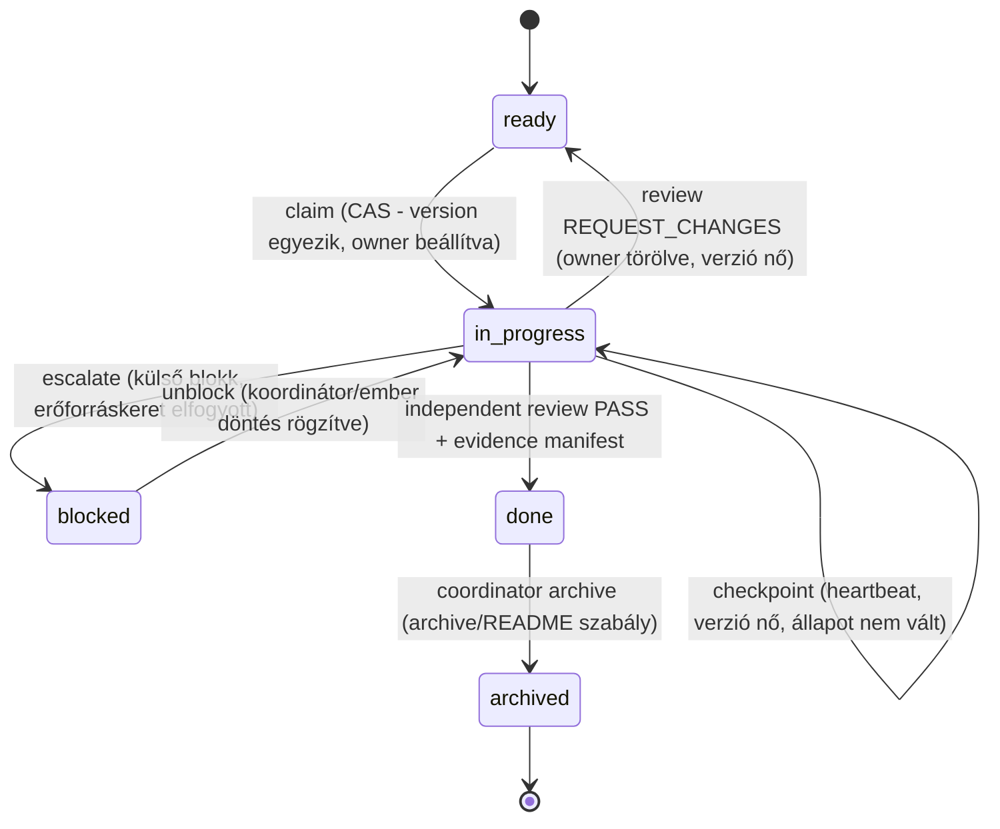
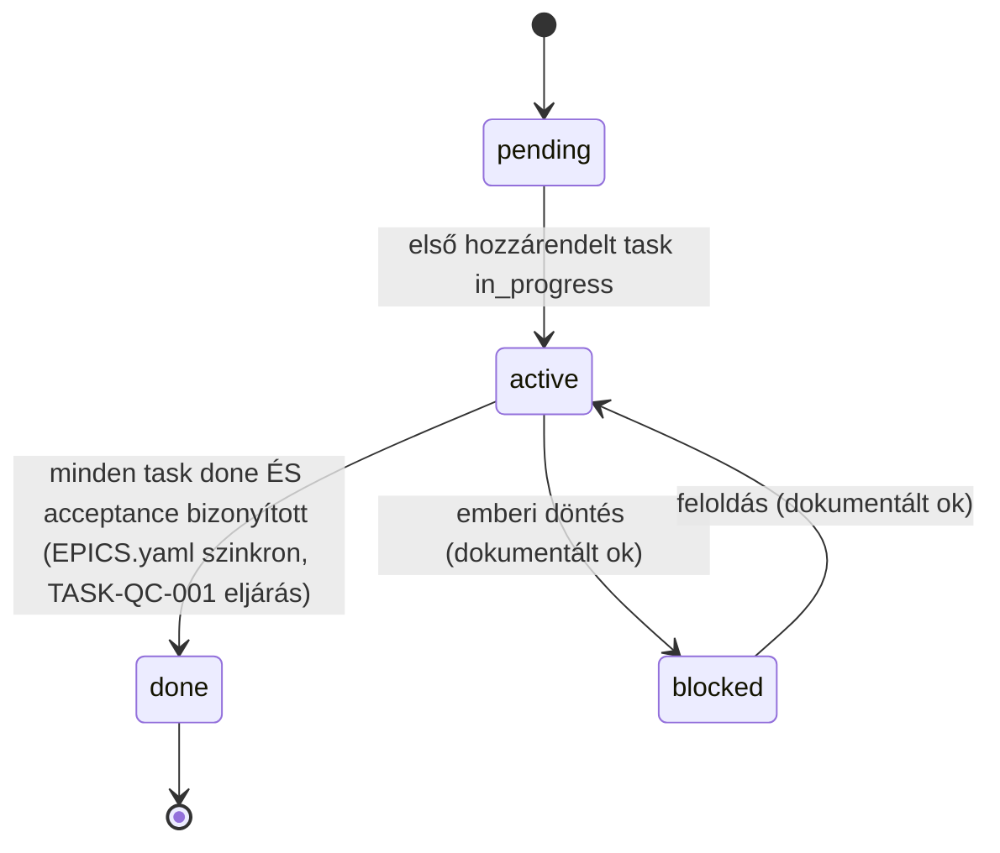

# ADR-068: Kanonikus projekt- és taskállapot-architektúra

- **Státusz:** accepted (3. körös, független adverzáriális review PASS eredménnyel
  zárta, ld. `docs/tasks/development-process/TASK-DP-002-canonical-state-adr.md`
  "Független review, 3. kör (2026-07-18)" szakasz)
- **Dátum:** 2026-07-18
- **Döntéshozó(k):** architect (worker agent, javaslattevő) — elfogadás Gábor vagy
  kijelölt független reviewer döntése
- **Rekonstruált:** nem — új döntés a 2026-07-18-i
  `fejlesztesi-folyamat-erettsegi-ertekeles.md` felmérés (DEVPROC-02, DEVPROC-03,
  DEVPROC-10 megállapítások) nyomán

## Kontextus

A 2026-07-18-i érettségi felmérés kritikus hibaként azonosította, hogy az
`EPICS.yaml`, a task-fájlok frontmatterje, egy SQLite-alapú "projects"
adatbázis, egy második SQLite-alapú epic-router adatbázis, egy fájlalapú
goal-store és három kézzel karbantartott emberi ledger (`state.md`, `todo.md`,
`MEMORY.md`) egymással **nem koordinált, részben ellentmondó** állapotforrások.
Ez a task ezt a kérdést zárja le ADR-szinten — kódot NEM módosít (fájlhatár:
`docs/architecture/decisions/` + saját taskfájl), az itt hozott döntés
végrehajtása a TASK-DP-003/004/005 feladata.

### Bizonyított, konkrét kódbeli ellentmondások

A kód közvetlen vizsgálata (nem csak a dokumentáció) az alábbi, ma is élő
write-útvonalakat tárta fel `docs/projects/EPICS.yaml` és a hozzá kapcsolódó
"epic"/"checkpoint" fogalmak körül:

1. **`knowledge-service/src/conductor/checkpointTracker.ts`** (`updateCheckpointStatus`,
   152–192. sor) — a TELJES fájlt `yaml.load`-olja, memóriában módosítja
   `epic.checkpoints[].status`-t, majd `yaml.dump` + `fs.writeFileSync`-kel
   visszaírja. A jelenlegi `EPICS.yaml` epic-objektumainak NINCS
   `checkpoints:` mezője — ez egy élő, de ma inaktív (0 találatos) kódútvonal,
   amely abban a pillanatban aktiválódik, amint valaki egy epichez
   `checkpoints:` listát ad hozzá.
2. **`knowledge-service/src/pipeline/epicRouter.ts`** (`updateCheckpointStatus`,
   533–587. sor, `handleTaskCompletion` hívja) — NEM parse-olja a YAML-t: soronkénti
   szövegmintázat-keresés (`condition:` blokk azonosítása), majd
   `line.replace('pending', 'done')` (566. sor) nyers szöveg-csere, utána a teljes
   fájl `fs.writeFileSync`. Ez a legtörékenyebb write-útvonal a repóban: egy
   véletlenül egyező `pending` szórészlet más sorban is módosulhatna, és a
   `checkpointTracker.ts`-től teljesen függetlenül, ugyanazt az adatot célozza.
3. **`knowledge-service/src/graph/epicsLoader.ts`** (`writeEpicsYaml`, 203–232. sor,
   a `graphRoutes.ts` PATCH-epic végpontja hívja) — az egyetlen atomi write:
   `${path}.tmp` írása majd `fs.rename`, hibánál temp-fájl törlés, séma- és
   DAG-validáció írás ELŐTT. Ennek ellenére: (a) nincs lock/CAS két egyidejű
   PATCH között (klasszikus TOCTOU — mindkét hívó a patch-előtti állapotot
   olvassa be, a második `rename` csendben felülírja az elsőt); (b) `yaml.dump`
   alapú újraszerializálás — ez is **eldobja a fájl fejléc-kommentjeit**
   (a js-yaml `dump` nem őriz meg kommentet), ugyanúgy, mint a
   `checkpointTracker.ts` útvonal.
4. **`knowledge-service/src/interfaces/http/routes/epic-router.routes.ts`**
   `/sync` végpontja `syncFromEpicsYaml`-t hív — a fájlból importál a SQLite
   `epics` táblába, ISMÉTELHETŐEN. Ez közvetlenül ellentmond a
   `checkpointStore.ts` és `projects.routes.ts` docstringjének, amely
   "one-time seed"-nek nevezi ugyanezt a műveletet (ld. lent, 5. pont).
5. **`knowledge-service/src/projects/checkpointStore.ts`** (fejléc, 1–13. sor) és
   **`knowledge-service/src/interfaces/http/routes/projects.routes.ts`**
   (fejléc, 1–17. sor) — szó szerint kijelentik: *"The EPICS.yaml file is at
   most a one-time SEED ... the DB is the source of truth"*. Ez a kijelentés
   ELLENTMOND (a) az `EPICS.yaml` saját fejléc-kommentjének (TASK-QC-001,
   amely a fájlt kanonikusnak deklarálja program/mérföldkő/epic szinten), és
   (b) a fenti 4. pontnak (a "one-time" jelző hamis, mert a `/sync` bármikor
   újrafuttatható).
6. **`knowledge-service/src/goalStore.ts`** (`checkCheckpointStatus`) egy
   HATODIK, független olvasó, amely szintén közvetlenül olvassa az
   `EPICS.yaml`-t saját feltétel-kiértékeléshez.
7. **`knowledge-service/src/mailbox.ts`** — fájlalapú (gray-matter frontmatter
   `.md` fájlok `terminals/<name>/{inbox,outbox}` alatt), a "kész" tényt egy
   HARMADIK reprezentációban tárolja (üzenet-frontmatter `status`), amelyet a
   `checkpointTracker.ts` `checkMessageStatus` funkciója az outbox-fájlok
   feltúrásával próbál összekötni a checkpoint `condition` string
   (`"MSG-X status=DONE"`) konvencióján keresztül — egy negyedik, string-alapú
   csatolási mechanizmus.
8. **Task-fájl frontmatter** (`docs/tasks/*/*.md` `status` mezője) — a kódban
   NINCS parser vagy writer, amely ezt programozottan olvasná/írná (a
   `mailbox.ts`/`inboxWatcher.ts` frontmatter-kezelése kizárólag az
   üzenet-`.md` fájlokra vonatkozik, más névtér). A task-frontmatter ma
   100%-ban kézi/agent-szerkesztésű szöveg, verzió/CAS/lock nélkül.
9. **`knowledge-service/src/pipeline/processLock.ts`** — az egyetlen létező
   lock-primitív a kódbázisban: fájlalapú, PID-tracking + 10 perces TTL
   (`STALE_LOCK_THRESHOLD_MS`), hardcode-olt `/tmp/spaceos-locks` útvonallal
   (POSIX-only, Windowson nem működik natívan). Egy-host, egy-folyamat
   szingularitás védelmére való, NEM adatverzió-CAS — nem alkalmas a fenti
   többszörös írók koordinálására.
10. **`knowledge-service/src/workflowManager.ts`** (`updateEpicStatus`,
    395–416. sor) — ismét egy TELJES fájl `yaml.load` (a modul saját
    `parseYamlFile` helperén át) → memóriabeli `epic.status = status`
    mutáció → `yaml.dump({ lineWidth: -1 })` → `fs.writeFileSync` ciklus,
    lock/CAS/validáció NÉLKÜL — ugyanaz a minta, mint az 1. pont, de az EPIC
    STÁTUSZT célozza (`pending`/`active`/`done`/`blocked`), nem a
    checkpointot. **Ez a listán a legkomolyabb, MA is ÉLŐ útvonal:** a
    `handleWorkflowTool` switch-e (`case 'update_epic':`, 644. sor) az
    `update_epic` MCP toolhoz köti (tool-definíció: 559. sor), amelyet
    BÁRMELY hitelesített MCP-kliens/agent ma is meghívhat — a regisztrációt
    a `src/__tests__/integration/mcpContract.integration.test.ts:157` és a
    `src/__tests__/unit/workflowManagerFs.test.ts:430-448` is megerősíti.
    Vagyis egy éles, hitelesített külső hívó MA, ezen ADR elfogadása előtt
    is, közvetlenül felülírhatja egy epic státuszát a fájlban — a
    `graph/epicsLoader.ts:writeEpicsYaml` séma-/DAG-validációja és atomi
    tmp+rename mintája NÉLKÜL, kommentvesztő módon.
11. **`knowledge-service/src/conductor/epicManager.ts`** (`completeEpic`,
    99–133. sor) — szerkezetileg azonos törékeny minta (teljes-fájl
    `fs.readFileSync` → `yaml.load` → `epic.status = 'done'` mutáció →
    `yaml.dump` → `fs.writeFileSync`), az 1. ponttal (`checkpointTracker.ts`)
    analóg. Ma NINCS route- vagy MCP-bekötése (kizárólag unit tesztből
    hívott) — alacsonyabb azonnali kockázat, mint a 10. pont, de UGYANAZ a
    törékeny, kommentvesztő, lock nélküli minta, és bármely jövőbeli
    bekötés (pl. egy route) azonnal éles kockázatot termelne.

### Kimerítő mechanikus leltár (2026-07-18, 3. kör — a 2. körös reviewer talált egy harmadik, korábban ki nem mondott writert; erre válaszul EGYETLEN körben, pontonkénti pótlás helyett teljes leltár készült)

A 2. körös review talált egy harmadik, a fentiek közül eddig sehol nem
szereplő élő writert (`pipeline/epicNotifications.ts`). Mivel ez már a
harmadik alkalom, hogy egyesével kerül elő egy-egy write-útvonal, ezúttal
**mechanikus, kimerítő leltár** készült pontonkénti keresés helyett:

```
rg -n "writeFileSync|yaml\.dump|fs\.writeFile\b" knowledge-service/src -g '*.ts' -g '!**/__tests__/**'
```

A parancs **114 találatot** adott (lásd a taskfájl Implementáció-szekcióját a
teljes nyers kimenetért). Kiegészítve egy második, a réshez vezető
felismerésből fakadó lekérdezéssel is (a `reviewLog.ts`-t az ELSŐ parancs
NEM fogta volna meg, mert `fs.appendFile`-t használ, nem
`writeFile`/`writeFileSync`/`yaml.dump`-ot):

```
rg -n "fs\.appendFile\b|appendFileSync\b" knowledge-service/src -g '*.ts' -g '!**/__tests__/**'
```

Minden találatot egyenként átnéztem: érinti-e `EPICS.yaml`-t, checkpoint-,
task-, review- vagy memória-adatot (a DP-002 hatáskörébe eső adatosztályokat).
A releváns találatok:

12. **`knowledge-service/src/pipeline/epicNotifications.ts`** (`saveEpics`,
    395–408. sor; `completeCheckpoint`, 414–462. sor) — **ez a listán a
    LEGVESZÉLYESEBB eset**, súlyosabb mint a 10. pont, mert NEM explicit
    tool-hívásra fut, hanem **automatikusan, eseményvezérelten**:
    `attachEpicNotifications()` (336. sor) a globális `pipelineEvents`
    event bus-ra iratkozik fel (`onAny`), feltétel/env-flag NÉLKÜL, a
    `bootstrap/startup.ts:385`-nél (`logger.info` 386. sor még "ENABLED"-nek
    is naplózza, feltétel nélkül). Az `outbox:done` eseményre (`case
    'outbox:done':`, 346. sor) ha az esemény adatában `epicId` ÉS
    `checkpointId` szerepel, meghívja a `completeCheckpoint`-et, amely
    `epic.checkpoints` teljes tömbjét bejárja, `checkpoint.status = 'done'`-t
    állít, ha MINDEN checkpoint kész, `epic.status = 'done'`-t ÉS egy, a
    sémában NEM deklarált `(epic as any).completed_date` mezőt is beállít
    (429. sor `any`-castolt property-írás), majd `saveEpics(data)` egy
    TELJES `yaml.dump({ lineWidth: 120, noRefs: true })` +
    `fs.writeFileSync(EPICS_PATH, ...)` ciklussal visszaírja a fájlt —
    lock/CAS nélkül, kommentvesztő módon, mint a többi.

    **Ironikus, önellentmondó bizonyíték:** az `outbox:done` eseményt KÉT
    független útvonal váltja ki — az `epicRouter.ts:513-518`
    (`emitOutboxEvent`, MCP `mcp_complete_task` route) ÉS az
    `inboxWatcher.ts:290-298` (fájlrendszer-watcher route). Az
    `epicRouter.ts:511-512` kommentje szó szerint ezt írja: *"ADR-053: Emit
    outbox:done event for subscription triggers — This is the DB-authoritative
    event, not file-based"* — miközben a `pipelineEvents`-re feliratkozó
    `epicNotifications.ts` pontosan emiatt az esemény miatt indít egy
    KÖZVETLEN fájlírást az `EPICS.yaml`-ra. A kód SAJÁT KOMMENTJE állítja
    az egyik igazságot ("DB-authoritative"), miközben a viselkedése a
    másikat produkálja (fájlírás) — ez szó szerint a split-brain minta,
    amit ez az ADR dokumentál, most már a kommentek szintjén is bizonyítva.

    **Még egy konkrét race:** ugyanabban a hívási láncban (`epicRouter.ts`
    `handleTaskCompletion`) a 513. sor kiadja az `outbox:done` eseményt
    (ami — ha van `epicId`/`checkpointId` az eseményadatban — aszinkron
    módon elindítja `epicNotifications.ts`-t), a 521–522. sor pedig
    UGYANEBBEN a függvényben KÖZVETLENÜL meghívja a 2. pontban már ismert
    regex-alapú `updateCheckpointStatus`-t is — vagyis EGY task-completion
    hívás MA is KÉT FÜGGETLEN, egymást nem ismerő write-útvonalat indíthat
    el ugyanarra a checkpointra, sorrend-garancia nélkül (az esemény-handler
    aszinkron, a közvetlen hívás szinkron).

13. **`knowledge-service/src/pipeline/projectDispatcher.ts`** +
    **`knowledge-service/src/projectTools.ts`** (`handleCreateProject`,
    35–116. sor körül) + **`knowledge-service/src/pipeline/statusUpdater.ts`**
    — egy **HARMADIK, teljesen párhuzamos projekt/mérföldkő/task-nyomkövető
    rendszer**, amelyet a Kontextus és a Döntés-táblázat eddig egyáltalán
    nem tárgyalt. A `create_project` MCP tool (`projectTools.ts:handleCreateProject`)
    a `getProjectsDir()` alá (`docs/projects/<slug>/` — UGYANAZ a könyvtár,
    mint ahol az `EPICS.yaml` él!) egy saját `PROJECT.md` + `TASKS.yaml`
    (`TaskChain` séma: `milestones[]` `status`/`blocked_by`/`tasks[]`) +
    `STATUS.md` hármast hoz létre. A `pipeline/projectDispatcher.ts`
    (`processProjectDone`, 263–325. sor) ezt a `TASKS.yaml`-t az
    `outbox:done` eseményre önállóan mutálja: `task.status = 'done'`
    (293. sor), `yaml.dump(tasks)` → `fs.writeFileSync(tasksPath, ...)`
    (298. sor), majd `checkMilestoneCompletion` — vagyis saját
    milestone-lezárási logikája is van, teljesen függetlenül az
    `EPICS.yaml programs[].milestones[]`-től. **Ma dormant adatban** (a
    `docs/projects/` alatt jelenleg KIZÁRÓLAG `EPICS.yaml` létezik, egyetlen
    `<slug>/` alkönyvtár sincs — tehát a `create_project` tool-t még soha
    senki nem hívta ebben a repóban), DE **élő és MCP-exponált a kódban**
    (`create_project`, `dispatch_next`, `list_blocked` toolok, a
    `projectTools.ts` fejléce szerint). Ha valaki ma meghívná a
    `create_project` toolt, egy HARMADIK, az ADR által eddig nem szabályozott
    milestone/task-állapotforrás jönne létre, a program-kanonikus
    `EPICS.yaml`-lal azonos szülőkönyvtárban.

14. **`knowledge-service/src/pipeline/reviewLog.ts`** (`appendReviewDecision`,
    37–43. sor; `queryReviewLog`, `getReviewAttemptCount`) — **ezt az ELSŐ
    (writeFile-alapú) mechanikus keresés NEM fogta volna meg**, mert
    `fs.appendFile`-t használ (`REVIEW_LOG_PATH =
    logs/reviews/decisions.jsonl`, JSONL, append-only, immutable log —
    ténylegesen egy már megvalósított eseménynapló-minta). Ezt a
    `pipeline/reviewer.ts` és a `pipeline/terminalReviewer.ts` (a
    dual-LLM, Architect+Librarian automatikus mailbox-DONE-review
    pipeline) egyaránt írja/olvassa `ReviewDecision` rekordokkal
    (`reviewer_a`/`reviewer_b` verdikt, `final_verdict`, `git_commit`,
    `escalated`). **Ez a lelet MÓDOSÍTJA (nem csak kiegészíti) a Döntés-
    táblázat "Review-döntés" sorának állítását** — ld. lent, Döntés
    szakasz javítása.

### Kiegészítő megfigyelések (kisebb súlyú, de a teljesség kedvéért dokumentált)

15. **MEMORY.md HÁROM programozott írója** (a Döntés-táblázat eddig
    "Kézzel írt"-nek minősítette): `identity.ts` `writeMemory`/`appendMemory`
    (145–193. sor, explicit `write_memory`/`append_memory` MCP tool mögött),
    `sessionStarter.ts` (368–384. sor körül, session-VÉG automatikus
    append, NEM explicit tool-hívás — a session lezárásának RÉSZEKÉNT fut),
    `pipeline/terminalReviewer.ts` (620–630. sor, `terminals/architect/MEMORY.md`
    automatikus append a review-pipeline-ból). Mindhárom `terminals/<name>/MEMORY.md`-t
    céloz (nem kizárólag `terminals/root/MEMORY.md`-t, de ugyanaz az
    adatosztály/fájlminta). Ld. Döntés szakasz javítása.
16. **Ötödik "checkpoint"-jelentés**: `contextPersistence.ts` (447–469. sor)
    egy "Stratégiai döntési pontok" (`checkpoint.decision`, `checkpoint.date`)
    naplót ír egy session-kontextus markdown fájlba — ez NEM az epic/
    cornerstone checkpoint, NEM a SQLite `epic_checkpoints`, hanem egy
    ötödik, önálló "checkpoint" fogalom (stratégiai döntési napló). Nem
    versengő state-writer (más adat), de tovább erősíti a terminológiai
    kockázatot, amit az ADR már a "task" szónál dokumentál.
17. **Hetedik `EPICS.yaml`-olvasó**: `pipeline/subscriptionManager.ts`
    (`parseCheckpointsFromEpics`, ~484–537. sor) az `EPICS_PATH`-ot csak
    OLVASSA (nincs `writeFileSync`/`yaml.dump` a fájlban) — újabb független
    fogyasztó, amely feltételezi az `epic.checkpoints[]` mező létezését.
18. **`pipeline/watchMonitor.ts`** (209–264. sor körül) szintén OLVASSA
    `epic.checkpoints`-et (Mode #4 program-awareness health-check prompt
    építéséhez) — ez is megerősíti az 1. pontban már jelzett tényt: a
    `checkpoints:` mező MA nem létezik az `EPICS.yaml`-ban, tehát ez az
    olvasó is néma-üres eredményt kap ma, de a kódútvonal élő.

### Elvetett (nem canonikus-state-releváns) találatok a 97-ből

A teljes 114 (+12 appendFile) találatból az ITT FEL NEM SOROLTAK egy-egy
mintája ellenőrzve lett és NEM releváns a DP-002 adatosztályaira (nem
`EPICS.yaml`, nem checkpoint, nem task-frontmatter, nem review-döntés, nem
`MEMORY.md`): codegen/scaffolding kimenetek (`generators/*`,
`codegen/patternScaffold.ts`) — generált kódfájlok, nem állapotadat;
mailbox `.md` üzenetfájlok (`mailbox.ts`, `task-message-box/store.ts`,
`messageRegistry.ts`, `session.tools.ts`, `telegramBot.ts`,
`messageRouter.ts`, `task-audit/taskCreation.ts`) — külön adatosztály,
ADR-066 hatásköre, már tárgyalva (7. pont); planning-pipeline dokumentumok
(`planSelect.ts`, `planDebate.ts`, `planScan.ts`, `planConfig.ts`,
`ideaScan.ts`, `skillFactory.ts`, `immediatePipeline.ts`) — ötlet-/terv-
dokumentumok, nem program/epic/task állapot; session/kontextus fájlok
(`contextSaturation.ts`, `sessionState.ts`, `sessionContextTransfer.ts`,
`handoff.ts`, `conductorBriefing.ts`) — session-szintű, nem program-szintű
állapot; `workflowManager.ts` 242/244/364. sor (`stateFile`,
`getStateFilePath`) — a WORKFLOW-domén (ADR-041) saját, `workflowId`-kulcsú
végrehajtási állapota, más adatosztály; `pipeline/common.ts` `STATE_FILE`
(`.nightwatch-state`) — a nightwatch cikluskövetés belső állapota;
`pipeline/missionControl.ts` — agent-delegálás célkönyvtárba, nem
EPICS-releváns; `runner/processedStore.ts`, `pipeline/pendingRetries.ts` —
a lokális runner/retry-sor saját dedup-állapota, más futásidejű koncepció;
`eval/goldenPath.ts` — eval-korpusz, nem program-állapot;
`api/planningRoutes.ts` — planning-doc szerkesztés, nem EPICS.

Egy módszertani tanulság: a `reviewLog.ts` (14. pont) az ELSŐ, szó szerint a
kapott `rg` mintával **nem lett volna megtalálható** (appendFile, nem
writeFile-család) — ezt a hiányosságot a második, kiegészítő `appendFile`
grep zárta be. Jövőbeli hasonló leltárhoz mindkét mintát futtatni kell.

Összesen tehát **14 write/store-találat** (1–14. pont) + **4 kiegészítő
megfigyelés** (15–18. pont, nem writer, de a teljesség kedvéért
dokumentált) érinti a DP-002 hatáskörébe eső adatosztályokat.
**Súlyossági rangsor módosítva a 3. kör után:** a 12. pont
(`epicNotifications.ts`, automatikus, eseményvezérelt, feltétel nélküli
bootstrap-bekötés) MOST a legveszélyesebb — súlyosabb, mint a korábban
legsürgősebbnek jelölt 10. pont (`update_epic` MCP tool), mert az utóbbihoz
legalább egy EXPLICIT tool-hívás kell valakitől, míg a 12. pont A NORMÁL,
elvárt task-completion folyamat RÉSZEKÉNT, bárki szándéka NÉLKÜL lefut.

## Döntés

**Két réteg, egyértelmű határral, adatosztályonként pontosan egy kanonikus
store-ral:**

1. **Design-intent réteg** (verziókezelt, git-history-vel auditálható,
   ember/agent PR-review-val módosítható, NEM tranzakciós): programcél,
   leállási feltétel, mérföldkő-elfogadás, epic scope/dependency/leírás →
   kanonikus forrás **`docs/projects/EPICS.yaml`**. Task cél, scope,
   elfogadási feltétel, függőség, owner_role, kilépési feltétel → kanonikus
   forrás **a task-fájl maga (frontmatter + törzs)**. Ez MEGERŐSÍTI a
   TASK-QC-001 döntését — nem bírálja felül.
2. **Tranzakciós runtime-state réteg** (konkurens írásnak kitett, géppel
   kikényszerített, verzió/CAS-szabállyal védett): task/epic ÁTMENETI
   állapot ("hol tart éppen"), ownership/claim/lease, dispatch-epizód,
   checkpoint/cornerstone TELJESÍTÉS ténye, review-döntés, release-eredmény →
   kanonikus forrás **egyetlen tranzakciós adatbázis** (a ma létező
   `epic_router.db` — SQLite, WAL — bővítése/konszolidációja, konkrét séma a
   TASK-DP-004 hatásköre).

| Adatosztály | Ma versenyző tároló(k) | Kanonikus döntés | Indoklás |
|---|---|---|---|
| Programcél / leállási feltétel | `EPICS.yaml programs[]` (egyetlen olvasó/író: ember/agent PR) | **EPICS.yaml** (megerősítve) | Nem tranzakciós; ritkán változik; git-history = audit |
| Mérföldkő elfogadás | `EPICS.yaml programs[].milestones[]` | **EPICS.yaml** (megerősítve) | ua. |
| Epic scope/leírás/függőség | `EPICS.yaml epics[]` | **EPICS.yaml** (megerősítve) | ua. |
| Epic ÁLLAPOT (pending/active/done/blocked) | (a) `EPICS.yaml epics[].status` — HÁROM egymástól független, egymást nem ismerő kódútvonal írja: `graph/epicsLoader.ts:writeEpicsYaml` (atomi, séma-/DAG-validált), `workflowManager.ts:updateEpicStatus` (ÉLŐ, `update_epic` MCP tool mögött — Kontextus 10. pont), `conductor/epicManager.ts:completeEpic` (ma csak tesztből hívott — Kontextus 11. pont); (b) SQLite `epics.status` (`checkpointStore.ts`/`epicRouter.ts`) | **EPICS.yaml** a design-intent szintű "epic lezárva"-tényre; a SQLite `epics` tábla EZUTÁN kizárólag **egyirányú, felülírható CACHE** a fájlból (soha nem fordítva). A HÁROM fájl-writer közül csak a `writeEpicsYaml` (validált, atomi) marad egyetlen elfogadott íróként; a `workflowManager.ts:updateEpicStatus` és a `conductor/epicManager.ts:completeEpic` KIVEZETENDŐ vagy a runtime-state réteg CAS-os claim-jén át route-olandó (Migráció 3. pont) — az `update_epic` MCP tool implementációja a validált writer (vagy a runtime-state réteg) mögé kerül át | A ma élő "DB a forrás" doc-komment (4–5. pont fent) tévesen írja le a valóságot — a program/epic-szintű döntés git-review-t igényel, ezt fájl hordozza hitelesen; a három versengő fájl-writer pedig önmagában is a split-brain kockázat egy másik dimenziója (nem csak fájl-vs-DB, hanem fájl-vs-fájl-writer) |
| Checkpoint/cornerstone TELJESÍTÉS | (a) `EPICS.yaml epics[].checkpoints[]` (ma üres/nem használt mező, de HÁROM élő writer célozza — 1., 2., 12. pont — köztük a 12. pont AUTOMATIKUS/eseményvezérelt, feltétel nélkül bekötve); (b) SQLite `epic_checkpoints` (`checkpointStore.ts`, audit trail-lel) | **SQLite `epic_checkpoints`** (a `checkpointStore.ts` audit-mintája) a runtime teljesítés-tényre; az (a) fájlbeli `checkpoints:` mező és az őt célzó `checkpointTracker.ts`/`epicRouter.ts`/`epicNotifications.ts` write-útvonalak **KIVEZETENDŐK** (DP-003/004 scope), a `epicNotifications.ts` NOTIFIKÁCIÓS mellékhatása (Telegram) MEGTARTANDÓ, csak a fájlírás-mellékhatása vágandó le | HÁROM versengő, egymást nem ismerő reprezentáció ugyanarra a tényre — a törékenyebbeket (regex-alapú, esemény-vezérelt) meg kell szüntetni, nem konszolidálni. Konkrét, MA IS élő race: egy task-completion (`epicRouter.ts:handleTaskCompletion`) EGYSZERRE indítja a 2. pont szinkron regex-writerét ÉS (eseményen át, aszinkron) a 12. pont writerét ugyanarra a checkpointra, sorrend-garancia nélkül |
| Task ÁLLAPOT (ready/in_progress/done/blocked) | Kizárólag task-fájl frontmatter (nincs versengő kódbeli writer ma) | **Task-fájl frontmatter** marad a küszöbérték (design-intent: "elfogadott-e a review"), DE a jövőbeli tranzakciós CLAIM (ki dolgozik rajta MOST) egy DB-sorba kerül, és a frontmatter `status` mező egyetlen, generált PROJEKCIÓVÁ válik ebből a DB-sorból (nem két agent versenyzik a fájlon) | Megerősíti TASK-QC-001-et a design-intent tényre, DE zárja a konkurencia-rést (7. pont) |
| Ownership / claim / dispatch-epizód | SQLite `terminal_context`, `task_queue` (`epicRouter.ts`) | **SQLite** (megerősítve, ez már ma is itt él helyesen) | Nincs fájl-megfelelője; inherensen tranzakciós adat |
| Mailbox üzenet-állapot (task/question/response/info) | `.md` fájl frontmatter (`mailbox.ts`) + `task-message-box` (ADR-066, DB-first) | **`task-message-box`** (ADR-066 szerint, már folyamatban lévő migráció) | Nem duplikáljuk ADR-066 döntését; ez az ADR csak megerősíti, hogy a "task" szó itt MÁS entitást jelöl, mint a program-task (ld. Nyitott kérdések) |
| "Goal" (monitor-trigger, ADR-059) | `goalStore.ts`, fájlonkénti YAML (`GOALS_DIR`) | **Marad fájlalapú, KÜLÖN fogalom** — nem program-goal, nem checkpoint | Alacsony tétjű automatizálási primitíva; a `generateGoalId()` ütközés-hajlama (QC-012, már trackelt bug) NEM ezen ADR hatásköre, de ezen ADR NEM áldja meg biztonságosnak |
| Harmadik, párhuzamos milestone/task-tracker (`<project>/TASKS.yaml`) | `docs/projects/<slug>/TASKS.yaml` (`TaskChain` séma, `projectTools.ts:handleCreateProject` + `pipeline/projectDispatcher.ts`, Kontextus 13. pont) — MA dormant adatban (nincs `<slug>/` alkönyvtár), de élő és MCP-exponált (`create_project`/`dispatch_next`/`list_blocked`) a kódban | **NEM autoritatív forrás semmilyen NEXUS-* programra** — ha valaha használatba kerül, a `create_project`/`TASKS.yaml` rendszer VAGY retirálandó, VAGY explicit módon az `EPICS.yaml` `programs[].milestones[]`/task-frontmatter modellre kell mappelnie, saját "harmadik séma" nélkül. Ezt az ADR NYITOTT KÉRDÉSKÉNT jelöli (ld. lent), mert a döntés (retirálás vagy más célra szánt, tudatosan külön rendszer) emberi/architekturális állásfoglalást igényel, ami túlmutat a DP-002 azonnali hatáskörén | Ugyanabban a könyvtárban (`docs/projects/`) él, mint az `EPICS.yaml` — ha valaha egyszerre használnák NEXUS-* célra, azonnali split-brain lenne; ma "csak" egy fel nem ismert, dokumentálatlan, MCP-exponált kockázat |
| Review-döntés | **NEM "nincs dedikált store"** — `pipeline/reviewLog.ts` MÁR LÉTEZIK (JSONL, append-only, immutable, `logs/reviews/decisions.jsonl`, Kontextus 14. pont), de ez az AUTOMATIKUS dual-LLM (Architect+Librarian) mailbox-DONE-review pipeline döntéseit tárolja, NEM a jövőbeli DP-008 feladat/ADR független emberi/agent review-gate-jét (creator≠reviewer, PASS/REQUEST_CHANGES egy TASK-XX fájlon) | A DP-008 implementálónak **explicit döntést kell hoznia**: bővíti-e a `reviewLog.ts` meglévő event-log mintáját a task/ADR-review adatra is, VAGY szándékosan külön store-t épít — de a két "review" fogalmat A NÉVBEN IS meg kell különböztetni, hogy ne ismétlődjön meg a "task" szó háromértelműségének problémája | A `reviewLog.ts` maga egy JÓ minta (immutable, append-only, pontosan az "eseménynapló" alternatíva, amit ez az ADR "most nem, de jövőre nyitva hagyva" minősít mint általános stratégiát) — ÉRDEMES lenne mintaként újrahasznosítani, nem csak elkerülni a névütközést |
| Release-eredmény | Nincs dedikált store ma (script-log, README) | **Új tranzakciós tábla/manifest** (TASK-DP-009 hatásköre) | ua. |
| `state.md` | Kézzel írt | **Egyirányú, újraépíthető PROJEKCIÓ** a fenti kanonikus store-okból; kézi szerkesztés tilos, ha a generátor él | Nem írhatja felül a kanonikus adatot (elfogadási feltétel) |
| `todo.md` | Kézzel írt | **Egyirányú, generált/reconciliált emberi nézet** | ua. |
| `MEMORY.md` | **NEM kizárólag "kézzel írt"** — HÁROM programozott író is van MA (Kontextus 15. pont): `identity.ts:writeMemory`/`appendMemory` (explicit `write_memory`/`append_memory` MCP tool), `sessionStarter.ts` (automatikus session-vég append), `pipeline/terminalReviewer.ts` (automatikus `terminals/architect/MEMORY.md` append a review-pipeline-ból) | **Csak tartós tanulság** — tranzakciós taskállapot NEM kerülhet bele; ez a HÁROM programozott írónak IS kötelező tartalmi korlátja (nem csak az embernek), és a jelenlegi néhány "aktuális fókusz"-jellegű kézi bejegyzés fokozatosan state.md/todo.md felé migrálandó (nem e task hatásköre, csak elv) | Elfogadási feltétel explicit követelménye; a programozott írók létezése NEM változtatja meg a döntést, de PONTOSÍTJA, hogy a korlát kódra is vonatkozik, nem csak emberi fegyelemre |

## Design intent

A réteghatárt NEM a technológia (fájl vs. DB), hanem a **változás jellege**
húzza meg: amit ember/agent PR-review-val, git-historyval, ritkán módosít
(cél, scope, elfogadás) — az a design-intent réteg, mert ott az érték éppen az
olvashatóság, diffelhetőség és a review-kényszer. Amit sűrűn, konkurensen,
géppel módosítunk (ki dolgozik most min, hol tart egy dispatch-epizód, melyik
checkpoint teljesült) — az a runtime-state réteg, mert ott az érték a
tranzakcionalitás és a verseny-mentesség.

A ma élő kód pontosan azért produkált ellentmondást (Kontextus, 1–11. pont),
mert ezt a határt SENKI nem húzta meg explicit módon: a `checkpointStore.ts`
2026-07-12-i szerzője jó okból (Gábor: "agentek megkerülik a fájlt")
DB-kanonikusnak deklarálta a checkpointokat, de anélkül tette, hogy az
`EPICS.yaml`-t közvetlenül író, egymástól független útvonalakat (1., 2., 10.,
11. pont) leállította vagy akár csak számba vette volna — ezért a ma futó
rendszerben MINDKÉT állítás ("a fájl a forrás" és "a DB a forrás") egyszerre
igaz kódrészletekben, ami maga a split-brain kockázat. A 10. pont
(`update_epic` MCP tool) mutatja, hogy ez nem elavult kódmaradvány: 2026-07-18-i,
aktívan tesztelt és regisztrált funkcionalitásról van szó.

Ez az ADR nem új technológiát vezet be, hanem **egyértelműsíti a már létező
építőelemek** (EPICS.yaml, task-frontmatter, epic_router.db) felelősségi
határát, és a QUALITY.md 8. pontjának egyszerűség-elvét követve a
törékenyebb, redundáns write-útvonalakat (regex-alapú fájlírás, kommentet
eldobó teljes-fájl-dump) **megszünteti**, nem konszolidálja bonyolultabb
közös absztrakcióba.

## Alternatívák

| Szempont | **Fájl-kanonikus** (minden állapot EPICS.yaml/frontmatterben) | **DB-kanonikus** (minden állapot SQLite-ban, fájl csak export) | **Eseménynapló-alapú** (append-only event log + derivált nézetek) | **Választott: hibrid (ez az ADR)** |
|---|---|---|---|---|
| Konzisztencia konkurens írásnál | Gyenge — fájl read-modify-write, nincs CAS (bizonyítva: 1–4. pont) | Erős a DB-n belül (SQLite tranzakció/CAS), de a fájlt figyelmen kívül hagyja → split-brain a design-intent oldalon | Erős (append-only, nincs felülírás), de minden derivált nézet újraszámítást igényel — nagy építési költség kis flottánál | Erős ott, ahol kell (DB, tranzakciós réteg); a design-intent réteg tudatosan NEM konkurens (git szerializálja) |
| Auditálhatóság | Jó (git history), de csak addig, amíg egyetlen író van | Jó, ha van `status_history` (mint `checkpointStore.ts`-ben már van) | Kiváló (maga a modell az audit trail) | Jó: git a design-intent oldalon, `status_history`/verzió-oszlop a runtime oldalon — event-log-szerű minimum extra infrastruktúra nélkül |
| Offline / CLI-agent használat | Kiváló (nincs szerver-függés) | Gyenge, ha "offline" = "nincs HTTP szerver", DE a DB lokális fájl — CLI közvetlen DB-eléréssel ugyanúgy offline-képes | Gyenge kis flottánál — a log-replay infrastruktúra túlméretezett | Mindkettő megtartja az offline-képességet (fájl mindig; DB CLI-n át, ld. lent) |
| Rollback | Trivialis (git revert) | Nehezebb (DB-migráció visszaállítás, backup-függő) | Elméletileg triviális (log truncate), gyakorlatban bonyolult replay-logika | A design-intent oldal git-revert-elhető; a runtime oldal additív séma + nem-destruktív migráció (ld. Migráció szakasz), így a rollback ott is olcsó |
| Építési/üzemeltetési költség | Alacsony, DE a bizonyított hibák (6 önálló, egymást nem ismerő EPICS.yaml-writer kódútvonal — Kontextus 1., 2., 3., 10., 11., 12. pont, ebből egy MA éles MCP-tool mögött, egy pedig MA automatikus/eseményvezérelt) mutatják, hogy "olcsón" mégis inkonzisztenciát termel | Közepes — a `epic_router.db` már létezik, bővíthető | Magas — teljes új infrastruktúra (event store, projection-rebuild pipeline) egy jelenleg pár terminálos flottánál aránytalan | Alacsony-közepes — meglévő elemek felelősségének tisztázása, NEM új rendszer |

**Miért nem a tiszta DB-kanonikus?** Mert a design-intent adatok (cél, scope,
elfogadás) értéke éppen az emberi olvashatóság és a git-alapú review — ezeket
DB-be zárni elveszítené a PR-review-kényszert, amit a program (DP-M3) egyébként
is épp bevezetni készül.

**Miért nem a tiszta fájl-kanonikus?** Mert ez a ma élő állapot, és pontosan ez
termelte a 9 bizonyított write-útvonal-ütközést (Kontextus szakasz).

**Miért nem eseménynapló most?** Nem elvi elutasítás — ha a flotta mérete
(terminálok, párhuzamos agentek száma) jelentősen nő, az event-sourcing
modell (a `status_history` JSON tömb már ma is egy mini event-log
`checkpointStore.ts`-ben) természetes következő lépés lenne. Jelen méretnél
(néhány terminál, `NEXUS-ISLAND-RUNTIME` M2 előtt) a teljes event-sourcing
építése arányталan költség/haszon — ezt ez az ADR NYITVA hagyja jövőbeli
újraértékelésre, de NEM választja most.

## Állapotgép, verzió/CAS és lock

### Task-lifecycle állapotgép (a runtime-state réteg vezérli, a frontmatter ebből vetül ki)



### Epic/mérföldkő/program állapotgép (design-intent réteg, git-review vezérli)



### Verzió/CAS-szabály (runtime-state réteg)

- Minden tranzakciós sor (task-claim, epic-cache, checkpoint) kap egy
  `version INTEGER` oszlopot. Minden írás `UPDATE ... SET version = version + 1
  WHERE id = ? AND version = ?` alakú; 0 érintett sor = ütközés — a hívó
  ÚJRAOLVAS és eldönti (retry vagy explicit "már lefoglalva X által" hiba),
  SOHA nem ír csendben felül.
- Több-utasításos átmenetek (pl. `checkpointStore.completeCheckpoint`, amely
  ma `getCheckpoint` → `UPDATE` két külön hívásban fut, TOCTOU-résként — ld.
  Konfliktus-forgatókönyv B) egyetlen `db.transaction(...)` (better-sqlite3
  szinkron tranzakció) alá kerülnek, hogy a folyamat-összeomlás soha ne
  hagyjon félbevágott állapotot.
- `PRAGMA journal_mode=WAL` + `PRAGMA busy_timeout` — több folyamat/host
  esetén a SQLite saját fájlzárolása szerializál; nem kell alkalmazásszintű
  elosztott lock.
- A `processLock.ts` fájlalapú PID+TTL lock (9. pont) MARAD a ma védett
  szingularitás-műveletekhez (pl. session-indítás dedup), de NEM alkalmas és
  NEM kerül kiterjesztésre adatverzió-CAS-ra — a runtime-state rétegben a
  DB-natív CAS az egyetlen elfogadott mechanizmus.
- A design-intent rétegben (EPICS.yaml, task-fájl törzs) a "lock" maga a git
  munkafolyamat: egy PR/commit szerializál, konfliktusnál a git merge jelez.

## Projekció és reconciliation

- **`state.md` / `todo.md`**: generátor a kanonikus store-okból (EPICS.yaml +
  task-frontmatter + runtime-state DB) épít fel egy pillanatképet; írás
  KIZÁRÓLAG atomi tmp+rename mintával (a `graph/epicsLoader.ts:writeEpicsYaml`
  már bizonyított mintája szerint, 203–232. sor). Kézi szerkesztés a
  generált fájlokon TILOS, amint a generátor élesedik (átmeneti időszakban,
  amíg a generátor nem kész, a mai kézi gyakorlat marad — ld. Migráció).
- **`EPICS.yaml epics[].status` mezőhöz kapcsolódó SQLite cache** (ha a
  runtime-state réteg megőrzi az `epics` táblát): egyirányú frissítés
  KIZÁRÓLAG fájl → DB irányban, `/sync` (vagy egy determinisztikus,
  ütemezett job) hívja; a DB→fájl irány ehhez a mezőhöz TILOS.
- **Reconciliation-riport**: egy (DP-003/004 scope) job összeveti az
  EPICS.yaml epic-státuszt a hozzá tartozó ÖSSZES task-frontmatter
  státusszal (pl. "epic done, de van benne ready/in_progress task" —
  invariáns-sértés) és a SQLite cache-t az EPICS.yaml-lal (drift-jelzés). A
  fájl NYER minden esetben; a DB-cache a fájlból frissül, soha fordítva.
  Ismétlődő drift (pl. 3 egymást követő futásban) eszkalációt jelent: valami
  még mindig ír a DB-be a fájl megkerülésével (regresszió a fenti 4/5. pontra).

## Migráció és dual-write kivezetés

Ez a szakasz TERV a DP-003/004 implementáló számára — ez a task (DP-002) kódot
nem módosít.

1. **Dry-run reconciliation riport (csak olvasás).** Script, amely
   összeveti EPICS.yaml epic-státuszt, SQLite `epics.status`-t és a
   hivatkozott taskok frontmatter-státuszát; kimenete diff-riport, NEM ír
   semmit. CI-ben informatív (nem blokkoló) módban fut N napig.
2. **Docstring-korrekció.** A `checkpointStore.ts`/`projects.routes.ts`
   "DB a forrás, fájl one-time seed" kommentjeit erre az ADR-re hivatkozva
   javítani kell (kódváltoztatás, DP-003/004 hatásköre).
3. **Törékeny writer kivezetése — SORREND FRISSÍTVE a 3. körös leltár után.**
   Prioritási sorrend (a legveszélyesebbtől):
   1. **`pipeline/epicNotifications.ts:completeCheckpoint`/`saveEpics`**
      (Kontextus 12. pont) — LEGELŐBB ez, mert AUTOMATIKUS/eseményvezérelt
      (bármely `outbox:done` esemény kiváltja, explicit tool-hívás vagy
      agent-szándék NÉLKÜL). A kivezetés a `attachEpicNotifications()`
      fájlírási mellékhatását vágja le; a Telegram-notifikációs
      mellékhatás (`notifyCheckpointComplete`/`notifyEpicComplete`)
      MEGTARTANDÓ — a függvényt szét kell választani (notify vs. write),
      és a "kész" tényt a SQLite `epic_checkpoints`-ből kell utólag
      lekérdezni a notifikációhoz, nem a fájlírásból.
   2. **`workflowManager.ts:updateEpicStatus`** (Kontextus 10. pont) — az
      `update_epic` MCP tool (`handleWorkflowTool`, 644. sor)
      implementációját át kell kötni a `graph/epicsLoader.ts:writeEpicsYaml`
      validált, atomi útvonalára (vagy a runtime-state réteg CAS-os
      claim-jére).
   3. `conductor/checkpointTracker.ts:updateCheckpointStatus` és
      `pipeline/epicRouter.ts:updateCheckpointStatus` (regex-alapú) —
      törlésre/letiltásra kerülnek; a checkpoint-teljesítés kizárólag a
      SQLite `epic_checkpoints`-en át történik.
   4. `conductor/epicManager.ts:completeEpic` (Kontextus 11. pont) — ma
      teszt-only, de semmilyen ÚJ bekötés nem engedélyezhető rá.

   Mind a négy pontot **EGYETLEN lépésben** kell kivezetni, nem ütemezve
   szét — a 3 egymást követő review-kör pontosan azt mutatta meg, hogy a
   pontonkénti/drip-feed kivezetés ugyanazt az inkonzisztencia-kockázatot
   termeli, mint a pontonkénti feltárás.
4. **Harmadik tracker (`<project>/TASKS.yaml`) hatáskör-döntés.** Emberi/
   architekturális döntés szükséges: (a) a `create_project`/`TASKS.yaml`/
   `pipeline/projectDispatcher.ts` rendszer RETIRÁLÁSRA kerül (ha nincs
   funkcionális igény rá), VAGY (b) explicit, dokumentált módon MEGMARAD
   más célra (pl. ügyfél-alprojektek, nem NEXUS-* governance-programok),
   de akkor is KÖTELEZŐ egy védőkorlát: a `create_project` tool ne
   engedjen olyan `slug`-ot, amely egy meglévő `EPICS.yaml programs[].id`-vel
   vagy epic-id-vel ütközik (namespace-elkülönítés). Amíg ez a döntés nem
   születik meg, a tool-t env-flaggel vagy explicit hozzáférés-korlátozással
   ideiglenesen le KELL tiltani, mert MA semmi nem védi a névtér-ütközést
   `docs/projects/EPICS.yaml` ellen.
5. **`reviewLog.ts` újrahasznosítási döntés (DP-008 bemenet).** A DP-008
   implementálónak explicit döntést kell hoznia: bővíti-e a meglévő
   `pipeline/reviewLog.ts` JSONL event-log mintáját a task/ADR független
   review-adatra is (ajánlott, mert a minta már bevált és immutable/
   auditálható), vagy szándékosan külön store-t épít — de a két "review"
   fogalom (automatikus mailbox-review vs. független task-review) nevében
   is megkülönböztetendő.
6. **Docstring-korrekció.** A `checkpointStore.ts`/`projects.routes.ts`
   "DB a forrás, fájl one-time seed" kommentjeit erre az ADR-re hivatkozva
   javítani kell (kódváltoztatás, DP-003/004 hatásköre). Az `epicRouter.ts:511-512`
   önellentmondó kommentjét ("DB-authoritative, not file-based", miközben
   ugyanaz az esemény fájlírást vált ki `epicNotifications.ts`-en át) is
   javítani kell — vagy a kommentet, vagy a viselkedést (a 3. pont
   kivezetése után a komment igaz lesz).
7. **`MEMORY.md` programozott íróinak tartalmi korlátozása.** Az
   `identity.ts:writeMemory`/`appendMemory`, `sessionStarter.ts` és
   `pipeline/terminalReviewer.ts` (Kontextus 15. pont) MEGTARTHATÓK
   funkcionálisan (a session-vég összegzés és a review-napló legitim
   "tartós tanulság"), DE a DP-004/DP-010 implementálónak dokumentálnia
   kell, hogy ezek az írások miért felelnek meg a "csak tartós tanulság,
   nem tranzakciós taskállapot" elvnek — nem automatikus felmentés csak
   azért, mert kód írja, nem ember.
8. **Dry-run reconciliation riport (csak olvasás).** Script, amely
   összeveti EPICS.yaml epic-státuszt, SQLite `epics.status`-t és a
   hivatkozott taskok frontmatter-státuszát; kimenete diff-riport, NEM ír
   semmit. CI-ben informatív (nem blokkoló) módban fut N napig.
9. **Tranzakciós task/epic-state tábla bevezetése** verzió/CAS-oszloppal, a
   fenti állapotgép szerint (DP-004 scope).
10. **Egyirányú projekció-generátor** `state.md`/`todo.md`-hez, atomi
    tmp+rename írással; első futás UTÁN emberi diff-review, mielőtt a
    "generált" jelző élesedik.
11. **Cutover-mérőszám:** 0 drift-találat legalább 5 egymást követő
    CI-futáson (munkanap) az EPICS.yaml/task-frontmatter (forrás) és
    bármely generált projekció/cache között.
12. **Rollback.** A migráció additív (új oszlopok/táblák + új
    generátor-script), nem töröl EPICS.yaml-t vagy task-fájlt. Rollback =
    az új generátor/CI-kapu hívásának leállítása, revert commit az új
    kényszerítő kódra; adatvesztés nincs, mert a kanonikus fájlforrások
    érintetlenek maradnak.
13. **Végdátum.** A dual-write toleráns (informatív, nem blokkoló) időszak a
    DP-M2 mérföldkő zárásáig tartson legfeljebb; a pontos naptári dátumot a
    DP-003/004 implementáló rögzíti kickoffkor (ez az ADR korábban készül,
    mint hogy a DP-003 elindulna, ezért nem határoz meg fix naptári dátumot,
    amit az implementáló úgysem tudna tartani).

## Offline, service-kiesés és sérült projekció

- **Offline CLI-agent:** mivel a runtime-state DB egy lokális SQLite-fájl
  (nem távoli szerver), az "offline" gyakorlatilag azt jelenti, hogy a
  knowledge-service HTTP-folyamat nem fut — a DB-fájl ettől függetlenül
  elérhető. A DP-004/005 implementálónak ezért egy közvetlen (HTTP nélküli)
  CLI-utat KELL biztosítania, amely ugyanazt a SQLite-fájlt nyitja meg
  (ugyanazon fájlzárolási szemantikával), nem egy workaround-ot. A
  design-intent rétegen (EPICS.yaml, task-fájl törzs) az offline szerkesztés
  ma is működik (git), ez változatlan marad.
- **Service-kiesés tranzakció közben:** mivel minden több-lépéses átmenet
  egyetlen SQLite-tranzakcióba kerül (ld. Állapotgép szakasz), egy
  összeomlott folyamat a DB-t a legutóbbi COMMIT-olt állapotban hagyja —
  nincs félbevágott write, az atomicitást maga a motor garantálja.
- **Sérült projekció** (`state.md`/`todo.md` törött vagy kézzel
  összezavart): mivel a projekció egyirányú és mindig újraépíthető a
  kanonikus store-okból, a helyreállítás = a generátor újrafuttatása, a
  kézi szerkesztés eldobásával. A projekció SOHA nem tekinthető hiteles
  bemenetnek semmilyen más folyamat számára.

## Konfliktus-forgatókönyvek (kötelező asztali/prototípus-elemzés)

### A — DB és YAML eltérés

*Helyzet:* `EPICS.yaml` szerint egy epic `active`, a SQLite `epics.status`
(pl. egy korábbi `/import-yaml` vagy `/sync` hívás után) `done`-t mutat.

*Levezetés:* Mivel ez az ADR az epic-státuszra az EPICS.yaml-t deklarálja
kanonikusnak és a SQLite `epics` táblát egyirányú cache-nek minősíti, a
konfliktus DEFINÍCIÓ SZERINT feloldott: a reconciliation job a fájlt olvassa
igaznak, és felülírja a cache-sort `active`-ra. A régi "frissebb, bizonyítékkal
alátámasztott forrás nyer" (TASK-QC-001 EPICS.yaml fejléc-szabálya) itt NEM
szimmetrikus versenyre utal, hanem arra, hogy MELYIK OSZTÁLYBA tartozó adatról
van szó — az epic-státusz osztálynál a fájl mindig nyer, függetlenül attól,
melyik írás történt később.

*Észlelés:* automatizált job (CI vagy ütemezett) diffeli a két forrást
azonosítónként; eltérésnél log-sor + (ismétlődésnél) eszkaláció, mert
ismétlődő eltérés azt jelzi, hogy egy tiltott writer (2., 4. pont a
Kontextusban) még mindig aktív.

### B — Félbeszakadt projekcióírás

*Helyzet:* a `checkpointStore.completeCheckpoint` ma (verifikálva,
`src/projects/checkpointStore.ts` 98–114. sor) KÉT különálló SQL-hívásból áll:
`getCheckpoint(id)` (SELECT), majd egy `UPDATE`. Ha a folyamat a kettő között
összeomlik, a checkpoint `pending` marad — ez ÖNMAGÁBAN biztonságos (nincs
félbevágott write), DE két PÁRHUZAMOS `completeCheckpoint(id)` hívás esetén
mindkettő `pending`-nek olvashatja a sort a másik UPDATE-je előtt, mindkettő
felépíti a saját `status_history` tömbjét, és a második `UPDATE` csendben
felülírja az első által hozzáfűzött history-bejegyzést (lost update).

*Levezetés/védekezés:* ez az ADR előírja, hogy a `getCheckpoint` + `UPDATE`
párost egyetlen `db.transaction(() => { ... })` szinkron blokkba kell zárni
(better-sqlite3 mintája), VAGY a history-appendet egyetlen atomi
`UPDATE ... SET status_history = json_insert(status_history, ...) WHERE
status != 'done'` utasítássá kell alakítani, amelynek érintett-sor-száma
(`changes`) jelzi a győztest. A jelenlegi kód emiatt egy VALÓS,
verifikálható race-t tartalmaz — ez az ADR nem javítja (fájlhatár), de a
DP-004 implementálónak kötelező belépő-kritériumként adja át.

Ugyanez a mintázat érvényes a `graphRoutes.ts` PATCH-epic végpontjára
(`epicsLoader.ts:loadEpicsYaml` → mutáció → `writeEpicsYaml`): két egyidejű
PATCH között nincs lock, a második `rename` csendben felülírja az első
változását. A projekció/writer-egyszerűsítés (Migráció, 3–4. pont) ezt a
TOCTOU-t is megszünteti azzal, hogy egyetlen writer-szolgáltatás marad az
EPICS.yaml-hoz.

### C — Párhuzamos transition (két worker ugyanazt a taskot claimeli)

*Helyzet:* két terminál/agent egyszerre próbálja a TASK-DP-002-t
`ready`→`in_progress`-re állítani (pontosan ez a helyzet, amit a
végrehajtási protokoll ma PROMPT-szinten, nem kóddal előz meg: a
koordinátor egy worker-t bíz meg, és bízik abban, hogy nem indít másikat is).

*Levezetés:* ma a task-frontmatter egy sima Markdown-fájl, amelyet egy
agent az Edit-tool-jával közvetlenül ír — két egyidejű írás a fájlrendszer
szintjén versenyez, koordináció NÉLKÜL (utolsó write nyer, YAML frontmatter
akár érvénytelenné is válhat interleaving esetén). A DP-004 által bevezetendő
védekezés: a CLAIM egy tranzakciós DB-sor CAS-művelete —
`UPDATE task_state SET status='in_progress', owner=?, version=version+1
WHERE task_id=? AND status='ready' AND version=?`. Amelyik hívás 0 érintett
sort kap, vesztett — explicit "már lefoglalva X által" választ kap, NEM ír a
fájlba. Csak a NYERTES claim-sor vált ki egy KÖVETKEZŐ, egyetlen-írós
projekció-frissítést a task-fájl `status` mezőjén (nem a két versengő agent
írja közvetlenül a fájlt). A task-fájl TÖRZSÉNEK (cél/scope) szerkesztése
design-intent marad — emberi/agent PR-review-val —, csak a `status` MEZŐ
válik géppel vezérelt projekcióvá.

Ez a minta megegyezik azzal, amit a `NEXUS-ISLAND-RUNTIME` TASK-ISL-005
(claim/lease/fencing/idempotency) épp most tervez — lásd Kapcsolódás más
programokhoz.

## Adverzáriális review

*Ebben a szakaszban a szerző szándékosan más szemszögből, reviewerként
próbálja megcáfolni az "egyetlen autoritatív forrás" állítást minden
konkrét write-belépési pontnál.*

| # | Belépési pont | Hogyan törhet meg az elv (konkrét kódbizonyíték) | Hogyan védekezik a tervezett architektúra |
|---|---|---|---|
| 1 | `conductor/checkpointTracker.ts:updateCheckpointStatus` | Teljes fájl yaml.load→dump→writeFileSync, kommentvesztő, ma inaktív de élő kódútvonal | Kivezetésre jelölve (Migráció 3. pont); amíg nincs kivezetve, ez az ADR EXPLICITEN figyelmezteti a DP-003/004 implementálót, hogy ez elsőbbséget élvez a schema-gate előtt |
| 2 | `pipeline/epicRouter.ts:updateCheckpointStatus` (regex `pending`→`done`) | Nyers szövegcsere, más sorral ütközhet, YAML-parse nélkül | Kivezetésre jelölve; az ADR kimondja: programozott EPICS.yaml-írás KIZÁRÓLAG a `graph/epicsLoader.ts:writeEpicsYaml` atomi, validáló mintáján keresztül engedélyezett a jövőben |
| 3 | `epic-router.routes.ts /sync` vs. `checkpointStore.ts`/`projects.routes.ts` "one-time seed" doc | A kód ÖNMAGÁNAK mond ellent: ismételhető sync ≠ one-time seed | Az ADR a `/sync`-et sanctioned, egyirányú (fájl→DB) cache-refresh műveletté minősíti át; a docstring-javítás kötelező follow-up (Migráció 2. pont) |
| 4 | `graph/epicsLoader.ts:writeEpicsYaml` (a "legjobb" writer) | Nincs lock két PATCH között (TOCTOU); yaml.dump itt is eldobja a kommenteket | Egyetlen-writer-szolgáltatás bevezetése (a többi négy útvonal megszűnése után ez marad az EGYETLEN programozott író); a kommentvesztés-kockázat nyitva marad (ld. Nyitott kérdések) |
| 5 | `goalStore.ts:createGoal` / `generateGoalId` | `Date.now().toString().slice(-3)` — bizonyítottan ütközés-hajlamos (QC-012, már trackelt, `ready` státuszú bug) | Ez az ADR NEM állítja biztonságosnak a mai ID-sémát; a Goal-objektumokat kifejezetten alacsony-tétű, best-effort automatizálásnak minősíti, KÍVÜL az állapotmátrix garanciáin — a tényleges javítás QC-012 hatásköre |
| 6 | Task-fájl frontmatter, agent általi közvetlen Edit | Semmi nem akadályozza, hogy egy agent saját magának írjon `status: done`-t (önreview) — ez pontosan az oka, amiért ennek a tasknak is `ready`-n kell maradnia | Ma procedurális (prompt-szintű) garancia; a DP-004 tranzakciós CLAIM-je + a DP-008 `reviewer != implementer` gépi invariánsa zárja a rést; amíg ezek nincsenek kész, a védelem NEM kódszintű — ez az ADR ezt nyíltan elismeri, nem állítja késznek |
| 7 | Mailbox `.md` (`mailbox.ts`) vs. SQLite `task_queue` vs. EPICS.yaml checkpoint `condition` string | Három független reprezentáció ugyanarra a "kész" tényre, csak egy törékeny string-konvención (`"MSG-X status=DONE"`) át kapcsolva | Az ADR-066 (task-message-box) irányát erősíti meg: a `checkMessageStatus` fájl-scanning módszer a mailbox teljes DB-first migrációja UTÁN megszüntetendő; addig ez egy elismert, nyitott rés |
| 8 | `POST /api/projects/epic` / `/checkpoint` HTTP API | Bármely hitelesített hívó közvetlenül írhat a SQLite `epics`/`epic_checkpoints` táblába, az EPICS.yaml-lal való kapcsolat ellenőrzése nélkül | A reclassifikáció (epic-státusz = fájl-kanonikus, DB csak cache) miatt egy ilyen írás legfeljebb a cache-t térítheti el egy reconciliation-ciklusig — de amíg a docstring/kivezetés (1–3. pont) nincs elvégezve, egy hívó a doc alapján jóhiszeműen a DB-t hihetné igaznak. Ez a Migráció-terv előtti állapotban komoly, de KÖZVETETT hézag (csak a cache-t érinti) |
| 9 | `workflowManager.ts:updateEpicStatus` az `update_epic` MCP tool mögött (`handleWorkflowTool`, 644. sor) | Teljes fájl yaml.load→dump→writeFileSync, lock/CAS/validáció nélkül; ÉLESEN hívható bármely hitelesített MCP-kliens/agent által MA, ezen ADR elfogadása ELŐTT is — ez a **legkonkrétabb, explicit tool-hívással azonnal kihasználható** rés, mert KÖZVETLENÜL a design-intent fájlt írja, validáció nélkül (a 3. körös leltár után: a 11. pont még ennél is súlyosabb, mert ott EXPLICIT hívás sem kell) | Kivezetésre/átkötésre jelölve, KIEMELT prioritással (Migráció 3. pont, 2. alpont); amíg nincs átkötve, ez az ADR EXPLICITEN kimondja, hogy ez MEGELŐZI sürgősségben az összes explicit-hívásos kivezetést — beleértve a 8. pontot is, mert ez a fájlt magát írja, nem csak egy cache-t |
| 10 | `conductor/epicManager.ts:completeEpic` | Szerkezetileg azonos törékeny minta, mint az 1. pont; ma nincs route- vagy MCP-bekötése, de bármely jövőbeli bekötés azonnal éles kockázatot termelne | Kivezetésre jelölve (Migráció 3. pont, 4. alpont); az ADR kimondja, hogy erre a függvényre semmilyen ÚJ bekötés nem engedélyezett — csak a `writeEpicsYaml` validált útvonal vagy a runtime-state réteg |
| 11 | `pipeline/epicNotifications.ts:completeCheckpoint`/`saveEpics`, `attachEpicNotifications` (bootstrap-bekötés feltétel nélkül) | **A TELJES LISTA LEGSÚLYOSABB találata**: AUTOMATIKUSAN, eseményvezérelten fut — sem explicit tool-hívás, sem agent-szándék nem kell hozzá, csak egy normál `outbox:done` esemény (amit MIND az MCP `mcp_complete_task` route, MIND a fájlrendszer-`inboxWatcher` kivált). Az `epicRouter.ts:511-512` kommentje kifejezetten "DB-authoritative, not file-based"-nek nevezi ugyanezt az eseményt, miközben az esemény MAGA indítja a fájlírást — a kód szó szerint önmagával ellentmond. Emellett egy `(epic as any).completed_date` mezőt is beállít, amely NINCS a sémában deklarálva | Kivezetésre jelölve, A LEGELSŐ helyen (Migráció 3. pont, 1. alpont) — a notifikációs mellékhatás (Telegram) megtartandó, csak a fájlírás vágandó le, a "kész" tényt a SQLite `epic_checkpoints`-ből kell utólag lekérdezni |
| 12 | `docs/projects/<slug>/TASKS.yaml` harmadik tracker (`projectTools.ts:handleCreateProject`, `pipeline/projectDispatcher.ts`, MCP `create_project`/`dispatch_next`/`list_blocked`) | Egy TELJESEN önálló milestone/task-séma (`TaskChain`), UGYANABBAN a könyvtárban (`docs/projects/`), mint az `EPICS.yaml` — ma dormant adatban, de élő és MCP-exponált a kódban; semmi nem védi, hogy egy jövőbeli `create_project` hívás ne ütközzön egy meglévő `EPICS.yaml` program/epic-azonosítóval | Ez az ADR NEM dönt retirálás vagy megtartás mellett (emberi/architekturális döntés kell — ld. Nyitott kérdések), de KÖTELEZŐVÉ teszi az azonnali namespace-védőkorlátot vagy a tool ideiglenes letiltását, amíg a döntés meg nem születik (Migráció 4. pont) |
| 13 | `pipeline/reviewLog.ts` és a "review" szó kettős jelentése | Egy MÁR MŰKÖDŐ, immutable event-log létezik review-döntésekre — de csak az automatikus mailbox-DONE dual-LLM pipeline-ra, NEM a DP-008 jövőbeli független task/ADR-review gate-jére. Ha a DP-008 implementáló ezt nem veszi észre, könnyen újra létrehozhatja PONTOSAN azt a "két dolog ugyanazzal a névvel" problémát, amit ez az ADR a "task" szónál már dokumentál | Ez az ADR explicit döntést ír elő a DP-008 számára (Migráció 5. pont): tudatos újrahasznosítás VAGY tudatos elkülönítés, de NÉV-ütközés nélkül |

**Összegzés:** az egyetlen-autoritatív-forrás elv MA, ebben a pillanatban,
KÓDSZINTEN nincs kikényszerítve sehol — ezt az ADR nem leplezi. Amit ez az
ADR ad: (a) egyértelmű, indokolt kijelölés minden adatosztályhoz, (b) a
legtörékenyebb, ténylegesen ütköző write-útvonalak KONKRÉT megnevezése
kivezetésre — a 3. körös leltár után a 11. pont (`epicNotifications.ts`,
automatikus/eseményvezérelt) a LEGSÚLYOSABB, megelőzve a korábban
legsürgősebbnek jelölt 9. pontot (`update_epic`, amelyhez legalább explicit
hívás kell) —, (c) a fennmaradó rések (5., 6., 7., 8., 9., 10., 11., 12.,
13. pont) explicit, owner-hez rendelt nyitott kérdésként, nem elhallgatva.
Egy módszertani tanulság is: a 13. pontot (`reviewLog.ts`) az ELSŐ,
`writeFile`-családra szűkített mechanikus keresés NEM fogta volna meg
(`appendFile`-t használ) — ez azt mutatja, hogy MAGA az adverzáriális
módszer (egyetlen rg-minta) is hiányos lehet, és a jövőbeli hasonló
leltárnak több minta-családot kell lefednie.

## Következmények

**Pozitív:**

- Az `EPICS.yaml` és a "projects DB" közötti, ma is bizonyított kódbeli
  ellentmondás (Kontextus 3–5. pont) egyértelmű, indokolt szabállyal
  feloldott.
- A törékeny, kommentvesztő és regex-alapú write-útvonalak megszüntetése
  csökkenti a jövőbeli silent-corruption kockázatot az `EPICS.yaml`-on.
- A task-frontmatter önreview-rése (6. pont) explicit napirendre kerül a
  DP-004/DP-008 számára, konkrét CAS-mintával.
- A state.md/todo.md drift (DEVPROC-03) megszűnik, mert a projekció
  egyirányúvá és újraépíthetővé válik.

**Negatív / kockázat:**

- A design-intent réteg (EPICS.yaml, task-fájl) programozott írása
  (writeEpicsYaml jellegű) MA sem őriz meg kommentet — ha a fájl
  fejléc-dokumentációja fontos marad (és az), a DP-003/004 implementálónak
  vagy comment-preserving YAML-könyvtárra kell váltania, vagy tudatosan
  vállalnia kell, hogy programozott írás csak akkor történik, ha a
  kommentvesztés elfogadható, VAGY a design-intent mezőket kizárólag
  ember/agent szöveges Edit módosítja (soha nem programozott parse-mutate-dump).
- A migráció (Migráció szakasz) önmagában is munkaigényes (DP-003/004/005
  hatáskör) — ez az ADR csak a tervet adja, a végrehajtás külön erőforrást
  igényel.
- Amíg a Migráció 1–3. pontja nincs végrehajtva, a 8. adverzáriási pontban
  leírt hézag (HTTP API közvetlen DB-írás, doc alapján jóhiszeműen "igaznak"
  hihető) ténylegesen fennáll.

## Biztonsági hatás

Nincs új auth/secrets-felszín; a döntés kizárólag adatforrás-felelősséget
oszt újra, meglévő, már autentikált (`authenticateRest`) végpontokon és
meglévő fájlokon belül. A HTTP API-k (projects.routes.ts) hitelesítése
változatlan marad; ez az ADR nem bővíti és nem szűkíti az elérhető
végpontok körét, csak a MÖGÖTTES adat autoritását definiálja újra.

## Kapcsolódás más programokhoz (NEXUS-ISLAND-RUNTIME)

A `TASK-ISL-001` (célarchitektúra) párhuzamosan dolgozik a szigetüzemi
identitás/state/lease/runner modellen; a `TASK-ISL-004` (kanonikus
task/message store) és `TASK-ISL-005` (claim/lease/fencing/idempotency) a
"runtime-state réteg" ezen ADR által kijelölt keretein BELÜL kell hogy
éljenek — nem egy harmadik, önálló igazságforrásként. Konkrétan:

- Az ISL program "task ownership atomi, tartós" célja a fenti Állapotgép és
  Verzió/CAS szakasz elveit (version-oszlop, CAS-UPDATE, egyetlen writer)
  kell hogy kövesse, sziget/terminál/runner összetett identitással
  namespace-elve (TASK-ISL-002 hatásköre).
- Az ISL "canonical task/message store" (TASK-ISL-004) és az ADR-066
  `task-message-box` (inter-island ÜZENET) valamint a jelen ADR
  "program-task" (docs/tasks/*.md, TASK-XX-NNN) fogalma HÁROM különböző
  entitás, amelyek mindegyike a "task" szót használja — ez önmagában
  terminológiai kockázat (ld. adverzáriális 7. pont és Nyitott kérdések).

Ez az ADR NEM dönt az ISL-program fizikai DB-elhelyezéséről vagy pontos
sémájáról — az a TASK-ISL-004/005 hatásköre, saját ADR-rel, ERRE az ADR-re
hivatkozva.

## Kapcsolódó kód

- `knowledge-service/src/projects/checkpointStore.ts` — SQLite `epic_checkpoints`,
  `upsertCheckpoint`, `completeCheckpoint`, `projectStatus`, `importEpicsYaml`
- `knowledge-service/src/interfaces/http/routes/projects.routes.ts` — `/status`,
  `/epic`, `/checkpoint`, `/checkpoint/:id/complete`, `/import-yaml`
- `knowledge-service/src/pipeline/epicRouter.ts` — SQLite `epic_router.db`
  (`projects`, `epics`, `terminal_context`, `task_queue`), `updateCheckpointStatus`
  (regex-alapú, kivezetendő), `handleTaskCompletion`
- `knowledge-service/src/interfaces/http/routes/epic-router.routes.ts` — `/sync`
  (`syncFromEpicsYaml`), `/task/:terminal/complete`
- `knowledge-service/src/conductor/checkpointTracker.ts` — `updateCheckpointStatus`
  (teljes-fájl yaml dump, kivezetendő), `checkCheckpointCompletion`
- `knowledge-service/src/graph/epicsLoader.ts` — `loadEpicsYaml`, `writeEpicsYaml`
  (atomi tmp+rename, egyetlen elfogadott EPICS.yaml-writer minta)
- `knowledge-service/src/graph/epicsValidator.ts` — séma/DAG-validáció
- `knowledge-service/src/workflowManager.ts` — `updateEpicStatus` (395–416.
  sor, teljes-fájl yaml dump, ÉLŐ az `update_epic` MCP tool mögött),
  `handleWorkflowTool` (`case 'update_epic':`, 644. sor), tool-definíció
  (559. sor)
- `knowledge-service/src/conductor/epicManager.ts` — `completeEpic` (99–133.
  sor, teljes-fájl yaml dump, ma csak tesztből hívott), `getNextCheckpoint`
- `knowledge-service/src/__tests__/integration/mcpContract.integration.test.ts`
  — az `update_epic` tool éles regisztrációjának bizonyítéka (157. sor)
- `knowledge-service/src/__tests__/unit/workflowManagerFs.test.ts` —
  `update_epic` viselkedési teszt (430–448. sor)
- `knowledge-service/src/pipeline/epicNotifications.ts` — `saveEpics`
  (395–408. sor), `completeCheckpoint` (414–462. sor, `epic.checkpoints`
  mutáció + `(epic as any).completed_date`), `attachEpicNotifications`
  (336. sor, feltétel nélküli event-bus feliratkozás)
- `knowledge-service/src/bootstrap/startup.ts` — `attachEpicNotifications()`
  hívás (385. sor, feltétel/env-flag nélkül)
- `knowledge-service/src/inboxWatcher.ts` — `outbox:done` esemény kiváltása
  fájlrendszer-watcher útvonalon (290–298. sor)
- `knowledge-service/src/pipeline/epicRouter.ts` — `emitOutboxEvent` (513–518.
  sor, "DB-authoritative, not file-based" önellentmondó komment 511–512. sor)
- `knowledge-service/src/projectTools.ts` — `handleCreateProject` (35–116.
  sor körül, `create_project` MCP tool, `PROJECT.md`/`TASKS.yaml`/`STATUS.md`
  scaffolding, `docs/projects/<slug>/` alá — UGYANAZ a szülőkönyvtár, mint
  az `EPICS.yaml`)
- `knowledge-service/src/pipeline/projectDispatcher.ts` — `TaskChain` séma,
  `processProjectDone` (263–325. sor, `task.status='done'`, `yaml.dump(tasks)`
  → `writeFileSync(tasksPath,...)` 298. sor), `checkMilestoneCompletion`
- `knowledge-service/src/pipeline/statusUpdater.ts` — `exportStatusJSON`,
  `STATUS.md` írás a harmadik tracker családjához
- `knowledge-service/src/pipeline/reviewLog.ts` — `appendReviewDecision`
  (37–43. sor, JSONL append-only, `logs/reviews/decisions.jsonl`),
  `queryReviewLog`, `getReviewAttemptCount`, `ReviewDecision` séma
- `knowledge-service/src/pipeline/reviewer.ts` és
  `knowledge-service/src/pipeline/terminalReviewer.ts` — a `reviewLog.ts`
  fogyasztói (automatikus dual-LLM mailbox-DONE review pipeline)
- `knowledge-service/src/identity.ts` — `writeMemory`/`appendMemory`
  (145–193. sor, `terminals/<name>/MEMORY.md`, explicit MCP tool mögött)
- `knowledge-service/src/sessionStarter.ts` — session-vég automatikus
  `MEMORY.md` append (368–384. sor körül)
- `knowledge-service/src/pipeline/terminalReviewer.ts` — automatikus
  `terminals/architect/MEMORY.md` append (620–630. sor)
- `knowledge-service/src/contextPersistence.ts` — ötödik "checkpoint"
  jelentés (stratégiai döntési napló, 447–469. sor), NEM epic/cornerstone adat
- `knowledge-service/src/pipeline/subscriptionManager.ts` — `parseCheckpointsFromEpics`
  (~484–537. sor), hetedik `EPICS.yaml`-olvasó (nem writer)
- `knowledge-service/src/pipeline/watchMonitor.ts` — `epic.checkpoints`
  olvasás health-check prompthoz (209–264. sor körül), megerősíti a dead
  schema-mező tényét
- `knowledge-service/src/goalStore.ts` — fájlalapú `Goal` (ADR-059), `GOALS_DIR`
- `knowledge-service/src/mailbox.ts` — fájlalapú mailbox `.md` (inbox/outbox)
- `knowledge-service/src/pipeline/processLock.ts` — PID+TTL fájl-lock
  (megmarad szingularitás-védelemre, nem CAS-helyettesítő)
- `knowledge-service/src/config/paths.ts` — `EPICS_PATH`, `GOALS_DIR`, `DATA_DIR`,
  a DB-fájlok (`epic_router.db`, `workflow.db`, `memory.db`, stb.) útvonalai
- `docs/projects/EPICS.yaml` — design-intent kanonikus forrás (program/mérföldkő/epic)
- `docs/tasks/*/*.md` frontmatter — design-intent kanonikus forrás (task)

## Bizonyíték

- Közvetlen kódolvasás (ez a futás, 2026-07-18): `checkpointStore.ts` 1–13,
  93–187. sor; `projects.routes.ts` 1–17, 86–101. sor; `conductor/checkpointTracker.ts`
  145–192. sor; `pipeline/epicRouter.ts` 484–587. sor (`handleTaskCompletion`,
  `updateCheckpointStatus`, regex `line.replace('pending','done')` a 566. sorban);
  `graph/epicsLoader.ts` 199–232. sor (`writeEpicsYaml`, atomi tmp+rename);
  `goalStore.ts` 1–217. sor (`createGoal`, `generateGoalId`, fájlalapú CRUD);
  `pipeline/processLock.ts` 1–60. sor (fájlalapú PID+TTL lock);
  `workflowManager.ts` 392–416, 559, 638–650. sor (`updateEpicStatus`,
  `update_epic` tool-definíció és `handleWorkflowTool` switch-ág);
  `conductor/epicManager.ts` 84–133. sor (`getNextCheckpoint`, `completeEpic`);
  `__tests__/integration/mcpContract.integration.test.ts:157` és
  `__tests__/unit/workflowManagerFs.test.ts:430-448` (az `update_epic`
  MCP-regisztráció és -viselkedés bizonyítéka).
- **3. kör (2026-07-18, exhaustive leltár):** `rg -n "writeFileSync|yaml\.dump|fs\.writeFile\b"
  knowledge-service/src -g '*.ts' -g '!**/__tests__/**'` (114 találat) +
  `rg -n "fs\.appendFile\b|appendFileSync\b" ...` (12 találat) — a teljes
  nyers kimenet a taskfájl Implementáció-szekciójában. Egyenként ellenőrzött
  releváns találatok: `pipeline/epicNotifications.ts` 336, 395–408, 414–462.
  sor; `bootstrap/startup.ts` 385–386. sor; `inboxWatcher.ts` 290–298. sor;
  `epicRouter.ts` 505–523. sor (a kettős write-race és az önellentmondó
  komment); `projectTools.ts` 35–116. sor; `pipeline/projectDispatcher.ts`
  263–325. sor; `pipeline/reviewLog.ts` 1–91. sor; `identity.ts` 130–193.
  sor; `sessionStarter.ts` 365–384. sor; `pipeline/terminalReviewer.ts`
  619–646. sor; `contextPersistence.ts` 440–472. sor;
  `pipeline/subscriptionManager.ts` 480–540. sor körül;
  `pipeline/watchMonitor.ts` 209–264. sor körül. `getProjectsDir()`
  (`config/paths.ts:73-75`) és `docs/projects/` tényleges tartalma
  (`ls docs/projects/` → kizárólag `EPICS.yaml`) igazolja, hogy a
  `TASKS.yaml` harmadik tracker ma dormant adatban.
- `docs/projects/EPICS.yaml` fejléc (1–41. sor) — TASK-QC-001 kanonikus-forrás
  deklarációja, amelyet ez az ADR megerősít epic/mérföldkő/program szinten.
- `docs/knowledge/fejlesztesi-folyamat-erettsegi-ertekeles.md` DEVPROC-02,
  DEVPROC-03, DEVPROC-10 — a felmérés, amely ezt a taskot kiváltotta.
- `docs/tasks/quality-compliance/archive/TASK-QC-001-project-state.md` —
  a korábbi, megerősített döntés a design-intent rétegről.
- `terminals/root/todo.md` — QC-012 (goalStore ID-ütközés) mint már trackelt,
  élő bizonyíték arra, hogy egy CAS nélküli, fájlalapú store valódi hibát
  termelt.

## Nyitott kérdések

- **Comment-preserving YAML.** A programozott EPICS.yaml-írás minden ma
  ismert módja (yaml.dump alapú `writeEpicsYaml` is) eldobja a fájl
  fejléc-kommentjeit. Emberi döntés kell: comment-preserving könyvtárra
  váltás (pl. a `yaml` csomag CST-API-ja) VAGY a design-intent mezők
  kizárólagosan szöveges (nem parse-mutate-dump) szerkesztése. Ezt az ADR-t
  ez nem blokkolja (a döntés a store-felelősségről független ettől), de a
  DP-003/004 implementálónak explicit döntést kell hoznia előtte.
- **Dual-write-kivezetés pontos végdátuma** — a Migráció szakasz szerint a
  DP-003/004 kickoffkor rögzítendő, mert ez az ADR korábban készül, mint a
  végrehajtás.
- **NEXUS-ISLAND-RUNTIME fizikai DB-elhelyezés** — a TASK-ISL-004 döntse el,
  hogy az ISL kanonikus task/message store UGYANAZT a fizikai
  `epic_router.db`-t (vagy utódját) bővíti-e, vagy logikailag különálló
  store, amely csak ezen ADR ELVEIT (tranzakciós, verzió/CAS, egyirányú
  projekció) követi. Ez az ADR nem dönt emellett/ellene, csak az elvi
  megfelelést írja elő.
- **Hármas "task" terminológia** (program-task / mailbox üzenet-task /
  ISL runtime work-assignment) — javasolt, hogy a TASK-ISL-004/005 és a
  TASK-DP-005 (egységes task discovery API) egyeztetett névtér-konvenciót
  vezessen be (pl. `TASK-<PROGRAM>-NNN` vs. `MSG-*`/UUID vs. ISL saját
  prefix), hogy a jövőbeli egységes discovery API (DP-005) ne mossa össze a
  három entitást. Ez az ADR csak jelzi a kockázatot, nem dönt a konkrét
  névtérről.
- **`goalStore.ts` átnevezése** — a "Goal" szó ütközik a program-szintű
  "goal" (EPICS.yaml `programs[].goal`) fogalommal. Kód-átnevezés (pl.
  `TriggerWatch`) javasolt, alacsony prioritású, külön (nem architekturális)
  cleanup taskban — nem blokkolja ezt az ADR-t.
- **Review/release store konkrét sémája** — szándékosan a TASK-DP-008/009
  hatáskörében marad; ez az ADR csak a namespace-elvet (ugyanaz a
  tranzakciós DB-konvenció) rögzíti.
- **`<project>/TASKS.yaml` harmadik tracker sorsa (KRITIKUS, embertől döntést
  igényel).** A `create_project`/`projectTools.ts`/`pipeline/projectDispatcher.ts`
  rendszer ma dormant adatban, de élő és MCP-exponált kódban, UGYANABBAN a
  könyvtárban (`docs/projects/`), mint az `EPICS.yaml`. Gábornak vagy egy
  emberi döntéshozónak el kell döntenie: (a) retirálandó (ha nincs
  funkcionális igény rá — a NEXUS-* programok soha nem használták), vagy
  (b) tudatosan megmarad más célra (pl. jövőbeli ügyfél-alprojektek), de
  akkor namespace-védőkorláttal az `EPICS.yaml` ellen. Amíg ez nem dől el,
  a Migráció szakasz 4. pontja szerint a tool-t ideiglenesen le kell
  tiltani vagy env-flag mögé kell tenni — ez az egyetlen olyan nyitott
  kérdés ebben a listában, amit `blocked`-kockázatúnak (nem csak
  `nyitott`-nak) minősítek, mert MA is bárki meghívhatja a `create_project`
  toolt namespace-védelem nélkül.
- **`pipeline/reviewLog.ts` újrahasznosítása vagy elkülönítése (DP-008
  bemenet)** — ld. Döntés-táblázat "Review-döntés" sora és Migráció 5.
  pont.
- **ADR-sorszámozási névtér koordinációja** — ez a task ADR-068-at foglalt
  le, miközben a párhuzamosan futó TASK-ISL-001 az ADR-077…085 tartományt
  vette igénybe (az index szerint ő maga korrigálta a sorszámot); ez is
  bizonyítja, hogy két párhuzamos ADR-készítő agent között a
  `docs/architecture/decisions/README.md` "szabad sorszám" mezője önmagában
  nem elég koordinációs mechanizmus — verseny esetén ütközhetett volna.
  Nem blokkolja ezt az ADR-t (a tényleges ütközés nem következett be), de a
  jövőbeli párhuzamos ADR-munkához egy explicit foglalási lépés (pl. a
  szabad sorszám azonnali, commit előtti bejegyzése) megfontolandó.
