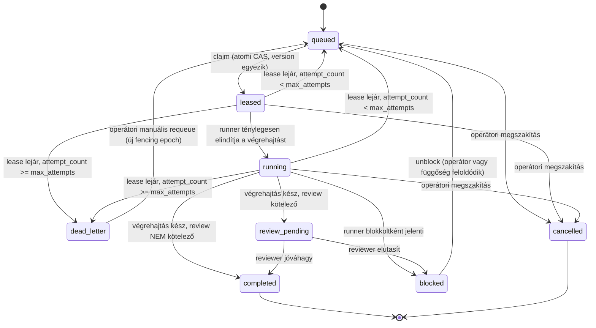

# ADR-079: Claim/lease/fencing/idempotencia állapotgép

- **Státusz:** proposed
- **Dátum:** 2026-07-18
- **Döntéshozó(k):** architect terminál (TASK-ISL-001), review-ra vár
- **Rekonstruált:** nem — új tervezési döntés

## Kontextus

SZIGET-04: a runner MVP (`src/runner/`) claim/dedup-mechanizmusa
KIZÁRÓLAG processzlokális. Konkrét bizonyíték: `sessionLauncher.ts`
`isBusy()` egy memóriabeli `Map<string, ChildProcess>`; a `processedStore.ts`
egy lokális JSON-fájlt olvas-ír (nem lockolt, nem tranzakciós). Szerveroldali
claim/lease endpoint NINCS — a task `UNREAD` marad a szerveren, amíg az agent
MCP-n nem nyugtázza. Két runner-folyamat (vagy a runner + egy service-oldali
watcher, lásd ADR-081) egyszerre lekérheti és elindíthatja ugyanazt a taskot.

## Döntés

### Állapotgép



### Mezők (task-message-box additív oszlopok, ADR-078 hatálya)

- `island_id`, `terminal_id` (ADR-077)
- `status` — a fenti állapotgép egyik értéke
- `lease_owner` — `runner_id` (ADR-077), NULL ha nincs aktív lease
- `lease_expires_at` — kötelezően kitöltött, ha `status IN ('leased',
  'running')`, egyébként NULL
- `fencing_token` — monoton növekvő egész, minden SIKERES claimnél
  eggyel nő
- `attempt_count` / `max_attempts`
- `idempotency_key` — egyedi index `(island_id, idempotency_key)` páron
- `created_at`, `updated_at`, `version` (optimista konkurencia CAS-hoz)

### Claim — egyetlen atomi feltételes művelet

```sql
UPDATE tasks
SET status = 'leased',
    lease_owner = :runner_id,
    lease_expires_at = :now_plus_lease_duration,
    fencing_token = fencing_token + 1,
    version = version + 1
WHERE island_id = :island_id AND terminal_id = :terminal_id
  AND task_id = :task_id AND status = 'queued' AND version = :expected_version;
-- affected rowcount == 1  →  sikeres claim; == 0 → vesztett verseny, retry/skip
```

`lease_expires_at` UGYANEBBEN a statement-ben kerül beállításra, mint a
`status='leased'` — ez zárja a "runner a claim után, de a futás elindítása
előtt összeomlik" ablakot: a lease attól a pillanattól számolja a
lejáratot, hogy a claim megtörtént, nem egy későbbi, külön "elindult"
eseménytől.

### Lease-megújítás (heartbeat)

```sql
UPDATE tasks
SET lease_expires_at = :now_plus_lease_duration, version = version + 1
WHERE task_id = :task_id AND lease_owner = :runner_id
  AND fencing_token = :held_fencing_token AND status IN ('leased','running');
```

Ha a `fencing_token` nem egyezik (valaki más már újra-claimelte a lejárt
lease-t), a megújítás 0 sort érint → a runner AZONNAL megszakítja a helyi
végrehajtást (a fencing token megakadályozza, hogy a régi tulajdonos
"feltámassza" a lease-t és duplikált üzleti hatást írjon).

### Lease-lejárat reaper

Ütemezett (vagy lusta, következő claim-kísérletkor futó) seprés: minden
sor, ahol `status IN ('leased','running') AND lease_expires_at < now()`,
atomi UPDATE-tel `queued`-ra (ha `attempt_count < max_attempts`,
`attempt_count += 1`) vagy `dead_letter`-re vált, MINDEN esetben növelve a
`fencing_token`-t, hogy a régi tulajdonos írása érvénytelen maradjon.

### Idempotencia

Üzleti hatású műveletek (pl. válaszüzenet létrehozása) `INSERT ... ON
CONFLICT (island_id, idempotency_key) DO NOTHING` mintával futnak — ismételt
kézbesítés vagy retry nem okoz kétszeres hatást.

### Review kapu

`review_pending → completed` csak explicit reviewer-akción keresztül
(rögzítve ugyanabban a store-ban); a végrehajtó `running`-ból sosem léphet
közvetlenül `completed`-be, ha a task típusa review-köteles (config-vezérelt
flag, `message-model.yaml` mintájára).

## Invariánsok

1. `lease_expires_at` pontosan akkor és csak akkor NOT NULL, ha
   `status IN ('leased', 'running')`.
2. `attempt_count` monoton nem csökkenő; csak explicit, naplózott operátori
   `dead_letter → queued` requeue nullázhatja/emelheti manuálisan.
3. `completed` kizárólag `running`-ból (review nem kötelező) vagy
   `review_pending`-ből (jóváhagyva) érhető el — sosem `queued`/`leased`-ből.
4. `idempotency_key` egyediségét DB-kényszer garantálja, nem csak
   alkalmazáslogika.
5. Minden sikeres claim és minden lejárat-alapú átmenet növeli a
   `fencing_token`-t; a runner minden side-effecting írásnál (BELEÉRTVE a
   fájlrendszeri projekció írását, ADR-078) köteles a saját
   `fencing_token`-jét ellenőrizni a store aktuális értékével szemben.

## Design intent

A claim egyetlen feltételes adatbázis-műveletként dől el — két runner
versenyében determinisztikusan csak az egyik kap sikeres választ, anélkül,
hogy elosztott lockolási protokollra lenne szükség (SQLite egyíró-szemantikája
elég egyetlen hoszton; több hoszt esetén ugyanez a minta egy megosztott
tranzakciós store felett működik, ADR-078). A fencing token a klasszikus
elosztott-rendszer mintát követi (Google Chubby/GFS lease-fencing): a
lejárt lease tulajdonosa nem bízhat a saját "még élek" feltételezésében,
a store dönt.

## Alternatívák

- **Csak `updated_at` alapú "stale" heurisztika, fencing nélkül** — elvetve:
  nem zárja ki, hogy egy visszatérő, lassú régi runner felülírja egy újabb
  tulajdonos munkáját.
- **Külső lock-szerver (pl. Redis/etcd)** — elvetve MOST: aránytalan
  infrastruktúra-többlet a jelenlegi méretskálán; a döntés újranyitható,
  ha a store elosztottsága (ADR-083 federation) ezt indokolja.
- **Optimista konkurencia fencing nélkül, csak `version` mezővel** — elvetve
  önmagában: a `version` CAS a CLAIM versenyét zárja ki, de nem védi a
  lease MEGTARTÁSÁT lejárat után — erre kell a külön `fencing_token`.

## Következmények

- Minden downstream launch- és federation-döntés (ADR-081, ADR-083) erre az
  állapotgépre és a `fencing_token`-invariánsra épít.
- A runner MVP (`src/runner/`) `ProcessedStore`-ja lokális, kiegészítő
  védelemként megmaradhat, de nem lehet a kizárólagos igazságforrás
  (ADR-081).

## Biztonsági hatás

A fencing token megakadályozza a "split-brain" írást lejárt lease esetén —
ez konkurencia-biztonsági, nem authN/authZ kérdés; az authZ-t az ADR-080
mondja ki.

## Kapcsolódó kód

- `knowledge-service/src/runner/pollLoop.ts`, `processedStore.ts`,
  `sessionLauncher.ts` — jelenlegi processzlokális claim, kiváltandó
- `knowledge-service/src/pipeline/epicRouter.ts` — jelenlegi
  `dispatchTask`/`markTaskDispatched`, kiváltandó (ADR-078)
- `knowledge-service/src/task-message-box/store.ts` — a claim/lease mezők
  additív bővítésének célhelye

## Bizonyíték

- Kód-felderítés 2026-07-18: `sessionLauncher.ts:43` memóriabeli `Map`,
  `processedStore.ts` lokális JSON, nincs szerveroldali claim endpoint.
- `docs/knowledge/terminal-agent-sziget-mukodes-ertekeles.md` SZIGET-04,
  javasolt állapotgép-vázlat.

## Nyitott kérdések

- **Skálázási plafon:** egyetlen SQLite-fájl egyíró-szemantikája nagy
  sziget-/terminálszám és magas claim-gyakoriság mellett írási szűk
  keresztmetszetté válhat AZ ÖSSZES sziget claimjeire nézve, ha egy közös
  fájlt használnak. Ez a döntés nem old meg egy jövőbeli horizontális
  skálázási igényt — jelezve, nem blokkoló, revizitálandó, ha a
  sziget-/terminálszám jelentősen nő (ISL-015 SLO-mérés adja meg az
  empirikus jelet).
- A `lease_duration` és `sweep_interval` konkrét alapértékei
  implementációs/SLO-részlet (ADR-085).
