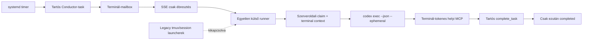

# Codex-elsődleges autonóm runner a VPS-en

## Vezetői összefoglaló

A JoineryTech VPS-en a Codex-alapú, headless agentfuttatás 2026-07-21-én
ellenőrzött üzemi állapotba került. A runner Linuxon automatikusan indul,
terminálonként legfeljebb egy sessiont enged, a régi közvetlen launchereket
kikapcsolja, a meglévő olvasatlan backlogot első induláskor karanténba helyezi,
és a munkát csak a szerver tartós `complete_task` visszaigazolása után tekinti
sikeresnek.

Az első időzített, valódi Conductor-ciklus (`MSG-CONDUCTOR-049`) végigfutott. Az
agent kanonikus prioritásütközést talált, ezért nem módosított forráskódot, hanem
tartós root-eszkalációt hozott létre (`MSG-ROOT-004`), frissítette a saját
`state.md`, `todo.md` és `MEMORY.md` fájljait, majd `complete_task` hívással
lezárta a sessiont. Ez az autonómia kívánt biztonságos viselkedése: egyértelmű
feladatot önállóan végrehajt, döntési vagy jogosultsági hiánynál pedig megáll és
bizonyítékot hagy.

Ez még nem a teljes `NEXUS-ISLAND-RUNTIME` garancia. A Linux + Codex út
üzemképes; a natív Windows Codex smoke, valamint a Claude és Antigravity valós
platformmátrixa nyitott. Az összetett szigetidentitás, a tartós lease/fencing,
a runner registry és a teljes kanonikus workflow külön ISL-taskokban készül.

## Cél, sikerkritérium és kilépési feltétel

**Cél:** a VPS termináljai elsődlegesen Codex CLI-val, emberi terminálablak és
tmux-indítás nélkül, tartós mailbox-feladatok alapján tudjanak dolgozni.

**A jelen rollout sikerkritériuma:** egy új feladat eljut a mailboxból a Codex
CLI-hoz; a Codex hitelesített MCP-n lekéri, ACK-olja és lezárja; az agent a
helyes terminál-workspace-ben fut; tud írni a kijelölt szigeten belül; nincs
kettős indítás; blokk esetén tartósan eszkalál és nem kerül ismétlődő ciklusba.

**Kilépési feltétel:** a Linux read-only és workspace-write canary PASS, az
első ütemezett Conductor-ciklus szabályosan lezárul, a szolgáltatások aktívak,
a rollback reprodukálható, és minden maradó korlát dokumentált. Ez a feltétel
teljesült. A teljes sziget-runtime program kilépési feltétele ettől szigorúbb,
és még nem teljesült.

## Megvalósult architektúra



### Indítási és ownership-szabályok

- A runner az egyetlen engedélyezett CLI launch authority ezen a deploymenten.
- A service watcher csak SSE-ébresztést küld; sessiont nem indít.
- A Nightwatch, AutonomousDev és AutoRestart launcherek ki vannak kapcsolva.
- A runner indulás előtt minden konfigurált inboxot felmér. Hiányzó vagy sérült
  lokális state esetén a teljes meglévő `UNREAD` állományt karanténként rögzíti.
  Ha bármely inbox lekérése hibázik, a runner fail-closed leáll, és nem indít
  részleges baseline-ból feladatot.
- A mailbox-feladat indítása előtt a runner szerveroldali claimet kér. Indítási
  hiba esetén a claimet elengedi.
- Terminálonként egy memóriabeli session és egy tartós `active.json` marker
  engedélyezett. A marker írási hibája launch-blokk; service-startkor a stale
  markereket kontrolláltan takarítja.
- A process exit code önmagában nem siker. `completed` csak `exit 0` és az adott
  session logjában szereplő sikeres, tartós `complete_task` eredmény együttese.

### Hitelesítés és jogosultság

- A runner master tokennel csak poll/claim/release műveletet végez.
- Minden child kizárólag a saját terminál-tokenjét kapja meg környezeti
  változóban; token nem kerül argumentumba vagy logba.
- A Codex MCP URL-je a VPS lokális `127.0.0.1:3458/mcp` végpontjára van
  felülírva, így az út nem függ a tailnet-cím visszahurkolásától.
- A headless futásban nincs interaktív approval UI. Emiatt a Codex általános
  approval policyja `never`, a két engedélyezett helyi MCP szerver eszközei pedig
  `default_tools_approval_mode="approve"` módot kapnak. A tényleges biztonsági
  határ a Codex sandbox, a helyi provider/terminal/model allowlist, a
  terminál-token és a szerveroldali autorizáció együttese.
- A runner kezdetben `read-only` sandboxban került élesítésre. Csak a teljes
  read-only canary után futott a backupolt `workspace-write` promóció.

Az MCP approval külön beállítása szükséges: az általános CLI approval policy
nem oldja fel automatikusan a headless MCP tool-hívásokat. A használt mezőt az
OpenAI Codex konfigurációs sémája definiálja:
[`default_tools_approval_mode`](https://github.com/openai/codex/blob/main/codex-rs/core/config.schema.json).
A headless alapfolyamat hivatalos belépési pontja a
[`codex exec`](https://learn.chatgpt.com/docs/non-interactive-mode), a repo- és
terminálutasítások kanonikus fájlja az
[`AGENTS.md`](https://learn.chatgpt.com/docs/agent-configuration/agents-md).

## Autonóm menedzsment

A `joinerytech-autonomy-enqueue.timer` 30 percenként legfeljebb egy Conductor-
ciklust próbál sorba állítani. Nem tesz fel új ciklust, ha:

1. aktív Conductor marker létezik;
2. a szerver szerint a Conductor már claimelt taskot birtokol;
3. az előző autonóm task még olvasatlan;
4. a Conductor `state.md` állapota `blocked`.

A negyedik kapu azért kritikus, mert az első valós ciklus szabályosan emberi
döntésre állt meg. Kapu nélkül a timer ugyanazt az eltérést újra és újra
felderítette volna. A blocked állapot a periodikus ciklust szünetelteti, de egy
célzott új inbox-task továbbra is felébresztheti a runnert; így a root válasza
automatikusan folytathatja a munkát.

Az ütemezett prompt kötelezően előírja:

- a pontos goal, mérhető success criteria és exit condition rögzítését;
- a taskfüggőségek és a `QUALITY.md` betartását;
- a delegálást kizárólag tartós mailbox-feladaton keresztül;
- legfeljebb 30 perc munkát és hibás műveletenként két retryt;
- célzott keresést, korlátozott fájlszakaszokat és arányos tesztet;
- a tasknapló, `state.md`, `todo.md` és `MEMORY.md` frissítését;
- döntési/jogosultsági blokknál a biztonságos leállást és eszkalációt.

## Platformbizonyíték

### Linux + Codex

```yaml
platform_evidence:
  os: linux-native
  os_version: "Debian GNU/Linux 13 (trixie)"
  architecture: x86_64
  shell: "GNU bash 5.2.37"
  node_version: "v22.22.1"
  cli: codex
  cli_version: "0.144.6"
  adapter: "nexus runner codexAdapter"
  auth_mode: "terminal-scoped bearer env; value redacted"
  sandbox: workspace-write
  result: PASS
```

Ellenőrzött canary-k:

| ID | Mód | Eredmény |
|---|---|---|
| `MSG-EXPLORER-025` | read-only | `fetch_task`, `ack_task`, `complete_task`, helyes `pwd` és `AGENTS.md`, exit 0, completed |
| `MSG-EXPLORER-026` | workspace-write | ideiglenes fájl létrehozás/ellenőrzés/törlés, MCP completion, exit 0, nincs maradvány |
| `MSG-CONDUCTOR-049` | időzített autonóm ciklus | kanonikus eltérés felismerve, `MSG-ROOT-004` eszkaláció, state/todo/memória mentve, biztonságos BLOCKED lezárás |

A blokkolt-state ismétlésvédelmet külön oneshot futás igazolta:

```text
[AutonomyEnqueue] skipped: Conductor state is blocked
```

### Windows + Codex

```yaml
platform_evidence:
  os: windows-native
  os_version: "Windows 11 Home 10.0.26200, 64-bit"
  shell: "Windows PowerShell 5.1.26100.8875"
  node_version: "v24.13.0"
  cli: codex
  cli_version: "0.144.5"
  result: BLOCKED
  blocker: "codex-windows-sandbox-setup.exe access denied; használható WSL-disztribúció nincs"
```

A Windows blokk nem adapter-PASS. A natív sandbox helper jogosultságát vagy
telepítését rendezni kell, majd a teljes mailbox→runner→Codex→MCP canary-t újra
futtatni. WSL Linux-bizonyíték lenne, nem Windows-native PASS.

### Claude és Antigravity

Az adapterek és a capability-discovery kód elkészült, de valós Linux és Windows
hitelesített smoke még nincs. Ezek az ISL-009, ISL-010, ISL-011, ISL-012 és
ISL-017 kapuk miatt nem minősíthetők kész támogatásnak.

## Üzemeltetési runbook

### Állapot és egészség

```bash
ssh nexus-vps 'systemctl status joinerytech-codex-runner.service --no-pager'
ssh nexus-vps 'systemctl status joinerytech-autonomy-enqueue.timer --no-pager'
ssh nexus-vps 'curl -fsS http://127.0.0.1:3458/health'
ssh nexus-vps 'find /opt/joinerytech/logs/codex-runner -maxdepth 3 -name active.json -print'
```

### Naplók

```text
/var/log/spaceos/codex-runner.log
/var/log/spaceos/codex-autonomy.log
/opt/joinerytech/logs/codex-runner/<terminal>/*.jsonl
/opt/joinerytech/logs/codex-runner/processed.json
```

Napló megosztása előtt a tokeneket, promptban szereplő üzleti adatokat és MCP
eredményeket külön redakciós ellenőrzéssel kell kezelni.

### Autonóm ciklus szüneteltetése

```bash
ssh nexus-vps 'sudo systemctl disable --now joinerytech-autonomy-enqueue.timer'
```

Ez nem állítja le a mailboxból célzottan érkező feladatok runnerét. A teljes
CLI-futtatás leállítása:

```bash
ssh nexus-vps 'sudo systemctl disable --now joinerytech-codex-runner.service'
```

### Újraindítás

```bash
ssh nexus-vps 'sudo systemctl restart spaceos-knowledge.service'
ssh nexus-vps 'sudo systemctl restart joinerytech-codex-runner.service'
ssh nexus-vps 'sudo systemctl start joinerytech-autonomy-enqueue.service'
```

A oneshot enqueue service siker után `inactive` állapotú; ez normális.

### Rollback

Az eredeti rollout előtti teljes backup:

```text
/opt/joinerytech/backups/codex-autonomy-20260721T195555Z
```

A workspace-write előtti runnerconfig-backup:

```text
/opt/joinerytech/src/joinerytech-nexus/knowledge-service/config/
runner.yaml.pre-workspace-write-20260721T201006Z
```

Visszaállítás:

```bash
ssh nexus-vps 'sudo systemctl disable --now joinerytech-autonomy-enqueue.timer'
ssh nexus-vps 'sudo systemctl disable --now joinerytech-codex-runner.service'
ssh nexus-vps 'cd /opt/joinerytech/src/joinerytech-nexus/knowledge-service && node scripts/codex-autonomy/rollback.mjs /opt/joinerytech/backups/codex-autonomy-20260721T195555Z'
ssh nexus-vps 'sudo systemctl restart spaceos-knowledge.service'
```

A systemd unitok külön, `/etc/systemd/system` alatt vannak; teljes rollbacknél
ezeket is el kell távolítani vagy letiltva kell hagyni, majd `daemon-reload`.

## GitHub- és release-készség

A megvalósítás a `nexus-dev` forrás része, nem kizárólag a VPS-en él:

- providerfüggetlen adaptercontract és registry;
- Codex, Claude és Antigravity adapter;
- configvalidáció és allowlistek;
- claim/release, backlog-karantén és aktív session marker;
- unit/integrációs tesztek;
- backup-first deploy, promóció és rollback bundle.

A repóba csak sablon és kód kerül; `.env.runner`, `runner.yaml`, terminál-token,
felhasználói Codex config és VPS-log nem publikálható. GitHub publikálás előtt a
CI teljes quality gate-jét, secret-scant, task-séma ellenőrzést és egy tiszta
checkoutból végzett buildet kell futtatni. A jelenlegi nagy, kevert munkafa miatt
a változás még nem tekinthető kiadott verziónak vagy release artifactnak.

## Nyitott kockázatok és következő kapuk

1. A teljes ISL-programhoz még hiányzik a kanonikus store + atomi lease/fencing;
   a mostani claim a legacy terminálcontextet használja, ezért egyetlen VPS és
   terminálonként egy runner keretében ad erős gyakorlati védelmet, nem általános
   elosztott exactly-once garanciát.
2. A Windows-native Codex út BLOCKED.
3. Claude és Antigravity valós 3×2 platformbizonyítéka hiányzik.
4. A régi 228 olvasatlan tétel karanténban maradt; nem indul el, de külön
   adattisztítás nélkül továbbra is a mailboxban van.
5. A root és monitor tmux sessionök tudatosan megmaradtak; launch-authority
   auditban továbbra is figyelni kell, hogy ne indítsanak párhuzamos CLI-t.
6. Az első Conductor-ciklus jelentős kontextust olvasott be. A blocked-state
   kapu és a promptban előírt bounded read csökkenti az ismétlési kockázatot,
   de a tényleges token-/költségtelemetria még ISL-015 feladat.
7. A teljes programot csak a `TASK-ISL-017` friss, független 3×2 E2E/chaos PASS
   után szabad garantáltnak nevezni.

## Reprodukálható lokális bizonyíték

2026-07-21-én a helyi Windows fejlesztői környezetben teljesült:

- TypeScript typecheck: PASS;
- teljes Vitest suite: PASS;
- célzott runner/mailbox/launch-authority tesztek: 6 fájl, 69 teszt PASS;
- build: PASS;
- deploy script `node --check`: PASS;
- izolált configure → workspace-write promóció → rollback dry-run: PASS, 49 fájl;
- DEV service `/health` és `/ready`: PASS a 3466-os porton;
- élő metadata-only mailbox route: HTTP 200, tartalom kihagyva;
- `git diff --check`: whitespace-hiba nélkül PASS.

Az ellenőrzések nem helyettesítik a nyitott Windows/Claude/Antigravity és
elosztott ownership kapukat; a fenti eredmény a jelenlegi Codex-elsődleges Linux
deployment reprodukálható üzemi bizonyítéka.
