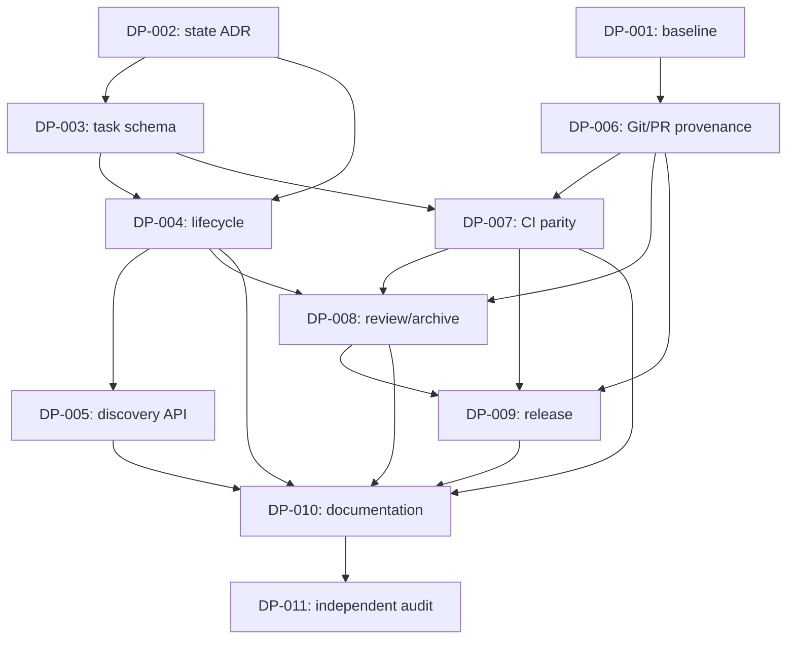

# A fejlesztésifolyamat-taskprogram létrehozása és indoklása

## A dokumentum célja

Ez a dokumentum rögzíti, hogyan és miért jött létre a
`NEXUS-DEVELOPMENT-PROCESS` program, miért négy mérföldkőre és tizenegy taskra
bomlik, milyen döntési logika határozta meg a függőségeket, valamint milyen
bizonyíték szükséges az egyes feladatok és a teljes program lezárásához.

A dokumentum azért szükséges, hogy a taskbontás mögötti szándék ne csak a
létrehozáskori beszélgetésben éljen. Egy későbbi implementáló, reviewer vagy
coordinator ebből megértheti, hogy melyik feladat milyen kockázatot kezel, és
miért veszélyes a sorrendet vagy a kilépési feltételeket indoklás nélkül
megváltoztatni.

Kapcsolódó források:

- felmérés és bizonyítékok:
  `docs/knowledge/fejlesztesi-folyamat-erettsegi-ertekeles.md`;
- végrehajtási program és közös szerződés:
  `docs/tasks/development-process/README.md`;
- gépi programállapot: `docs/projects/EPICS.yaml`;
- normatív minőségi elvárások: `QUALITY.md`.

## Kiinduló probléma

A felmérés szerint a Nexus dokumentált fejlesztési elvei jók, de a tényleges
folyamat több ponton nem kényszeríti ki őket. A taskprogram létrehozását az
alábbi, egymással összefüggő problémák indokolták:

1. a nagy és kevert `main` munkafán a késznek jelölt taskok nem kapcsolódtak
   egyértelmű commit- és PR-egységekhez;
2. az `EPICS.yaml`, a projects/checkpoint adatbázis és az Epic Router eltérően
   nevezte meg a kanonikus állapotforrást;
3. a task, EPICS, `state.md`, `todo.md` és memória kézi szinkronja már láthatóan
   elsodródott;
4. nem volt repository-szintű task-frontmatter-, dependency-, archive- és
   reviewer-validáció;
5. a task-status API a régi `new/active/archive` könyvtármodellt feltételezte;
6. a független review elv volt, de nem minden lezárási út kötelező gépi kapuja;
7. a helyi minőségi workflow fejlettebb volt, mint a commitolt, távoli CI;
8. a Windows CI és a release teljes provenance-lánca nem volt bizonyított;
9. nem létezett egyetlen manifest, amely a taskot, commitot, CI-t, review-t,
   artifactot, release-t és végső állapotszinkront összekötötte volna.

Ezek nem független dokumentációs hiányosságok. Ugyanannak a folyamatláncnak a
megszakadásai, ezért egyetlen koordinált programban kell őket kezelni.

## A taskbontás alapelvei

### Egy task egy bizonyítható kontrollt valósítson meg

Egy task akkor review-zható jól, ha egy világos invariánst vagy kontrollt tesz
igazzá. A bontás ezért nem fájlszám, becsült kódsor vagy csapatszerep alapján
történt, hanem a bizonyítandó eredmény szerint.

Például a task-séma validálása és a task-status API átépítése kapcsolódó
területek, de két külön kontroll:

- a séma megakadályozza az érvénytelen állapot létrejöttét;
- az API biztosítja, hogy minden interfész ugyanazt az érvényes állapotot lássa.

Ha egy taskba kerülnének, egy részleges implementáció könnyen késznek tűnhetne.

### A döntés előzze meg a tartós implementációt

A source-of-truth kérdés több komponens felelősségi határát módosítja. Emiatt a
`TASK-DP-002` ADR kötelező előfeltétele a task-sémának, a lifecycle-nak és a
discovery API-nak. Enélkül a csapat könnyen automatizálná a jelenlegi
ellentmondást, vagy újabb dual-write réteget építene.

### A helyreállítható baseline előzze meg a Git-szétbontást

A `TASK-DP-001` nem egyszerű „takarítási” feladat. Először veszteségmentesen
bizonyítani kell, hogy minden staged, unstaged és untracked változásnak ismert a
tulajdonosa és a célja. Csak ezután biztonságos task-scoped commitokat és PR-eket
létrehozni a `TASK-DP-006` keretében.

Ez a sorrend védi a felhasználó és más agentek már meglévő munkáját.

### A policy önmagában nem kontroll

A branch-, review- vagy archiválási szabály leírása szükséges, de nem elég. A
program minden fontos szabálynál negatív tesztet is előír: a hibás tasknak, az
önreview-nak, a stale review-nak, a piros CI-nek és a hibás release-nek
bizonyítottan el kell buknia.

### A végső reviewer ne az implementáció folytatása legyen

A `TASK-DP-011` implementációs feladat helyett adverzáriális audit. A reviewer
nem javíthatja saját findingját, mert az összemosná a készítő és az ellenőr
szerepét. Hiba esetén az érintett taskot kell visszanyitni vagy külön follow-up
feladatot kell létrehozni.

## Miért négy mérföldkő?

### DP-M1 — Kontrollált baseline és állapotdöntés

Először azt kell tudni, hogy milyen változások léteznek, és melyik rendszer mely
adatért felel. E két alap nélkül minden további automatizálás bizonytalan
baseline-ra vagy ellentmondó állapotmodellre épülne.

### DP-M2 — Géppel kikényszerített task-életciklus

A második mérföldkő a taskot teszi megbízható egységgé. Ide tartozik a séma, a
függőségi gráf, a transitionök, a checkpoint/review/archive életciklus és az
egységes tasklekérdezés.

### DP-M3 — Változásintegráció, CI és független review

Csak érvényes task-életciklus után köthető biztonságosan a fejlesztés Githez,
required CI-hez és reviewerhez. Ez a mérföldkő alakítja át a dokumentált
elvárást tényleges merge-kapuvá.

### DP-M4 — Release-bizonyíték, dokumentáció és audit

A zöld merge még nem bizonyítja, hogy a futó rendszer ugyanazt az ellenőrzött
artifactot használja. Az utolsó mérföldkő ezért összeköti a release-t,
smoke/canaryt, rollbacket, clean-room dokumentációt és a független auditot.

## A tizenegy task és a mögöttes „miért”

| Task | Miért önálló feladat? | Kezelt fő kockázat |
|---|---|---|
| `TASK-DP-001` | A meglévő munka megőrzése külön kontroll a későbbi Git-szabályoktól. | Változásvesztés, kevert scope, ismeretlen owner |
| `TASK-DP-002` | Az állapotarchitektúra döntés, nem mechanikus refaktor. | Split-brain, dual-write, rossz migráció |
| `TASK-DP-003` | A taskok érvényessége minden további automatizálás bemeneti kapuja. | Hibás YAML, ciklus, árva vagy bizonyíték nélküli task |
| `TASK-DP-004` | A státuszátmenetnek konkurencia- és crash-biztosnak kell lennie. | Félbemaradt transition, stale overwrite, elsodródó projekció |
| `TASK-DP-005` | A helyes tároló sem elég, ha az interfészek eltérő taskhalmazt látnak. | Legacy scanner, API- és emberi nézet eltérése |
| `TASK-DP-006` | A taskot tényleges diffhez és merge-egységhez kell kapcsolni. | Közvetlen main-munka, nem auditálható commit/PR |
| `TASK-DP-007` | A lokális siker csak távoli és kétplatformos reprodukcióval kapu. | Nem autoritatív CI, Windows regresszió, teszt-szennyezés |
| `TASK-DP-008` | A review és archive külön jogosultsági/életciklus-kontroll. | Önreview, stale approval, evidence nélküli `done` |
| `TASK-DP-009` | A merge és a futó artifact közötti láncot külön kell bizonyítani. | Nem az ellenőrzött kód deployolása, sikertelen rollback |
| `TASK-DP-010` | A működés csak akkor fenntartható, ha chat nélkül reprodukálható. | Rejtett tudás, platformeltérés, hibás üzemeltetés |
| `TASK-DP-011` | A program saját állításait függetlenül meg kell cáfolni vagy igazolni. | Papíron kész, ténylegesen megkerülhető folyamat |

## Miért csak két task `ready`?

A program létrehozásakor kizárólag a `TASK-DP-001` és `TASK-DP-002` kapott
`ready` állapotot.

- A DP-001 kizárólag leltároz és biztonságos baseline-t készít. Nem függ attól,
  hogy később melyik állapotarchitektúra kerül elfogadásra.
- A DP-002 architekturális döntést készít. Nem szükséges hozzá a munkafa előzetes
  commitokra bontása.
- A két feladat ezért egymással párhuzamosan, egymás fájljainak módosítása nélkül
  elvégezhető.

A további kilenc task `blocked`, mert valamelyik korábbi eredmény nélkül nagy
eséllyel hibás kontrollt vagy újabb átmeneti réteget építene. A `blocked` itt
nem bizonytalanságot jelent, hanem szándékos design- és biztonsági kaput.

## A függőségi lánc indoklása

A kritikus út szándékosan hosszabb a puszta implementációnál: a program célja
nem a gyors dokumentumtermelés, hanem az, hogy egy későbbi `done` állítás
bizonyítható legyen.

## Miért kötelező a goal, sikerkritérium és kilépési feltétel?

E három adat eltérő kérdésre válaszol:

- **Goal:** milyen állapotot akarunk elérni?
- **Sikerkritérium:** milyen mérés vagy bizonyíték mutatja, hogy elértük?
- **Kilépési feltétel:** mikor szabad befejezni vagy megállni?

Ha csak goal létezik, a worker saját megítélése alapján nyilváníthatja késznek a
munkát. Ha csak checklist létezik, a feladat technikailag kipipálható úgy, hogy
az eredeti cél nem teljesül. A kilépési feltétel pedig megakadályozza a végtelen
próbálkozást és az indokolatlan scope-bővítést.

## Miért kötelező az evidence manifest?

A prose implementációs napló az emberi megértést segíti, de nehezen validálható.
A géppel olvasható manifest közös azonosítóval köti össze:

- a taskot és a goalt;
- a base commitot, branchet és tényleges commitokat;
- a futtatott környezetet és parancsokat;
- a CI- és review-eredményt;
- a release- és rollback-bizonyítékot;
- a task/EPICS/state/todo/memória szinkront.

Így a reviewernek nem fájl- és Git-régészetből kell rekonstruálnia a történetet,
és később CI-kapu is építhető ugyanarra a sémára.

## Miért külön state, todo és memória?

E három fájl más időtávot szolgál:

- `state.md`: aktuális, rövid életű működési pillanatkép;
- `todo.md`: a következő konkrét teendők emberi nézete;
- `MEMORY.md`: hosszú távon újrahasznosítható döntés és tanulság.

Az azonos státusz kézi másolása mindháromba elsodródást okoz. A program ezért a
state és todo generálását vagy determinisztikus reconciliationjét célozza, a
memóriába pedig csak explicit tartós tanulság kerülhet.

## Kapcsolódás a többi programhoz

### NEXUS-QUALITY

A quality program a kódminőség, biztonság, coverage, konfiguráció és
dokumentáció konkrét kapuit építi. A development-process program nem duplikálja
ezeket, hanem azt biztosítja, hogy a kapuk valóban required CI-, review- és
release-bizonyítékként kapcsolódjanak minden változáshoz.

### NEXUS-ISLAND-RUNTIME

Az island-runtime program egy nagy, többplatformos agentcsapat-fejlesztés. Ez
lesz a fejlesztési folyamat egyik első reprezentatív felhasználója. A két
program átfedő témáinál egy implementáció is elegendő, de mindkét program
elfogadási feltételéhez külön bizonyítékhivatkozás kell.

## Mikor szabad módosítani a taskbontást?

A program nem változtathatatlan. Task összevonható, bontható vagy új task
hozzáadható, ha:

1. az ok és a kezelt kockázat dokumentált;
2. a program goalja és kilépési feltétele nem gyengül;
3. a dependency DAG továbbra is ciklusmentes;
4. az EPICS-, README-, task-, state- és todo-hivatkozások egyszerre frissülnek;
5. scope-tágításnál architekturális vagy emberi jóváhagyás történik;
6. a változás nem teszi lehetővé egy kontroll megkerülését vagy önreview-ját.

Task nem törölhető pusztán azért, mert nehéz, külső jogosultságot igényel vagy
negatív tesztje hibát talál. Ilyenkor a helyes állapot `blocked`, pontos feloldási
feltétellel.

## Végső döntési elv

A taskprogram akkor tölti be a szerepét, ha a fejlesztési folyamat állításai
nem bizalmon alapulnak, hanem reprodukálhatók és megcáfolhatók. A taskok
létrehozásának központi „miértje” ezért a következő:

> A Nexusban a `done` ne egy agent vagy ember véleménye legyen, hanem ugyanarra
> a goalra, forrásverzióra, tesztre, review-ra és állapotra mutató, függetlenül
> újraellenőrizhető bizonyíték.
