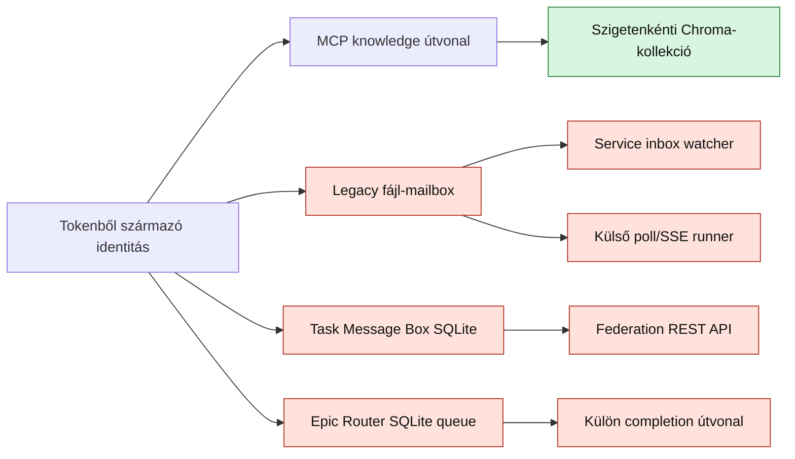

# Terminálalapú agentcsapatok szigetüzemének érettségi értékelése

> **2026-07-21 operatív frissítés:** a Linux + Codex autonóm runner út a
> JoineryTech VPS-en read-only, workspace-write és valós időzített Conductor
> canaryval PASS. Ez javítja az egy-szigetes operatív képességet, de nem írja
> felül az itt dokumentált, teljes több-szigetes ownership/lease/fencing és 3×2
> platformhiányokat. Aktuális evidence és runbook:
> [Codex-elsődleges autonóm runner a VPS-en](codex-autonom-runner-vps-uzemeltetes.md).

## Vezetői összefoglaló

A Nexus jelenlegi állapotában **egy sziget, egy szerver és terminálonként egy
runner** mellett már használható agentcsapat-platform. A projektben megtalálható
az identitás, a szerepkörök, a mailbox, a task queue, a reviewer, a
futásfelügyelet és a helyreállítás több fontos építőeleme.

Ugyanakkor a rendszer még **nem garantálja valódi, egymástól izolált,
többgépes szigetek biztonságos működését**. A fő ok nem az egyes funkciók
hiánya, hanem az, hogy az identitás, az üzenetállapot, a task ownership és a
sessionindítás több, egymással párhuzamos modell között oszlik meg.

Az architekturális érettség becslése:

| Üzemmód | Érettség | Minősítés |
|---|---:|---|
| Egy sziget, egy szerver, terminálonként egy runner | 7/10 | kontrollált bétaüzemre alkalmas |
| Több sziget, szigetenként ismétlődő szerepnevekkel | 4/10 | név- és állapotütközések lehetségesek |
| Többgépes, hibatűrő, biztonságosan izolált működés | 3/10 | még nincs garantálva |
| Összesített platformérettség | 5/10 | ígéretes orchestration béta |

> A pontszámok architekturális érettségi becslések, nem formális
> megfelelőségi mérőszámok. Az értékelés a 2026-07-18-i aktuális munkafára
> vonatkozik.

## Mit jelent itt a garantált szigetüzem?

Egy sziget egy önálló agentcsapat, amelynek saját termináljai, feladatai,
mailboxai, tudása és futási állapota van. A garantált működéshez az alábbi
invariánsoknak minden API-n és minden hibamódban teljesülniük kell:

1. **Izoláció:** egy sziget agentje nem láthatja és nem módosíthatja egy másik
   sziget adatait jogosultság nélkül.
2. **Egyértelmű identitás:** ugyanaz a szerepnév, például `backend`, több
   szigeten is biztonságosan létezhet.
3. **Egyértelmű task ownership:** egy feladatnak egy időben legfeljebb egy aktív
   végrehajtója lehet.
4. **Tartós állapot:** service- vagy runner-újraindítás nem veszít el taskot,
   státuszt vagy tulajdonosi információt.
5. **Determinált helyreállítás:** egy elhalt runner feladata időkorlát után
   biztonságosan újra kiosztható.
6. **Idempotens kézbesítés:** újraküldés vagy hálózati hiba nem okoz kétszeres
   üzleti végrehajtást.
7. **Kikényszerített workflow:** a review, a budget és a jogosultsági kapuk nem
   megállapodások, hanem minden belépési ponton érvényes rendszerinvariánsok.
8. **Bizonyíthatóság:** metrikákból, auditnaplóból és többpéldányos tesztekből
   igazolható a helyes működés.

## A jelenlegi rendszer mentális modellje



A diagram lényege, hogy a knowledge izolációja már jól körülhatárolt, de a
mailbox, a federation, az Epic Router és a sessionindítás nem ugyanarra a
kanonikus, tranzakciós állapotra épül.

## Bizonyított erősségek

### Tokenalapú, szerver által meghatározott identitás

Az `AUTH_MODE=required` módban a terminál és a sziget a tokenből származik. A
kliens által küldött terminálnév nem írhatja felül a hitelesített identitást.
Ez jó fail-closed alap a további jogosultsági modellhez.

Érintett kód:

- `knowledge-service/src/auth/tokenAuth.ts`
- `knowledge-service/src/interfaces/mcp/tools/knowledge.tools.ts`

### MCP knowledge izoláció

Az MCP knowledge műveletek a hitelesített request contextből kapják a szigetet,
a vector store pedig szigetenként külön Chroma-kollekciót vagy memóriateret
használ. Az érvénytelen szigetazonosítókat a rendszer visszautasítja.

Érintett kód és teszt:

- `knowledge-service/src/vectorStore.ts`
- `knowledge-service/src/__tests__/unit/islandScoping.test.ts`

### Runner-védelmek egy folyamaton belül

A runner konfigurációja fail-closed módon vár tokent, ellenőrzi az engedélyezett
terminálokat és parancsokat, valamint egy runnerfolyamaton belül nem indít két
aktív child processt ugyanahhoz a terminálhoz.

Az SSE értesítés csak a polling felgyorsítására szolgál. Az SSE kapcsolat
megszakadása ezért önmagában nem állítja le a taskfelvételt.

Érintett kód:

- `knowledge-service/src/runner/runnerConfig.ts`
- `knowledge-service/src/runner/sessionLauncher.ts`
- `knowledge-service/src/runner/pollLoop.ts`
- `knowledge-service/src/runner/sseListener.ts`
- `knowledge-service/src/runner/processedStore.ts`

### Megfigyelési és helyreállítási építőelemek

A projektben már létezik strukturált logolás, health/readiness endpoint,
runner-task log, retry, heartbeat, Nightwatch, státusztörténet és SQLite WAL.
Ezek jó alapok, de jelenleg nem minden komponens használja őket egységesen, és
több felügyeleti mechanizmus alapértelmezetten nincs bekapcsolva.

## Fő megállapítások

### SZIGET-01 — Nincs összetett sziget–terminál–runner identitás

**Súlyosság: kritikus**

A jelenlegi mapping lényegében `agentnév → sziget`. Egy agentnév globálisan csak
egy szigethez rendelhető. A mailbox és több konfigurációs útvonal szintén a
globális terminálnevet tekinti identitásnak.

Ez azt jelenti, hogy két külön sziget `backend` terminálja nem első osztályú,
egymástól elkülönült entitás. A szerepek szigetnévvel történő átnevezése
kerülőút lenne, de nem oldaná meg következetesen az autorizációt, a routingot és
a konfigurációvalidációt.

**Szükséges invariáns:** minden task, message, mailbox, queue-bejegyzés és
session kulcsa tartalmazza az `island_id`, `terminal_id` és szükség esetén a
`runner_id` értéket.

### SZIGET-02 — Az izoláció nem egységes minden interfészen

**Súlyosság: kritikus**

Az MCP knowledge útvonal helyesen használja a hitelesített szigetet. A REST
knowledge route azonban szigetparaméter nélkül hívja a keresést, ezért az
alapértelmezett szigetet használja.

A Task Message Box MCP adapter nem használja következetesen a tool contextet.
Bizonyos műveletek tetszőleges terminál inboxát vagy ismert üzenetazonosítót
érhetnek el. A federation REST route a body/query által küldött szigetértékeket
fogadja el, ahelyett hogy minden esetben a hitelesített identitáshoz kötné őket.

Érintett kód:

- `knowledge-service/src/interfaces/http/routes/knowledge.routes.ts`
- `knowledge-service/src/interfaces/mcp/tools/task-message-box.tools.ts`
- `knowledge-service/src/mcp-tools.ts`
- `knowledge-service/src/interfaces/http/routes/federation.routes.ts`

**Következmény:** az MCP knowledge jelenlegi izolációjából nem következik a
teljes platform szigetizolációja.

### SZIGET-03 — A mailbox fájlrendszeri névtere globális

**Súlyosság: kritikus**

A legacy mailbox a `TERMINALS_PATH/<terminal>` szerkezetet használja, szigetnév
nélkül. A Task Message Box adatbázisában van `from_island` és `to_island`, de a
fájlrendszeri leképezés továbbra is csak a célterminál nevét használja.

Két külön sziget azonos nevű termináljai ezért ugyanarra a könyvtárra eshetnek,
ami téves kézbesítést vagy állapotütközést okozhat.

Érintett kód:

- `knowledge-service/src/config/paths.ts`
- `knowledge-service/src/mailbox.ts`
- `knowledge-service/src/task-message-box/store.ts`

### SZIGET-04 — Nincs szerveroldali atomikus task claim vagy lease

**Súlyosság: kritikus**

A runner helyi `processedStore` fájlban tartja nyilván az indításokat. Ez egy
folyamaton belül csökkenti a duplikációt, de két gép vagy két runnerfolyamat nem
osztja meg ezt az állapotot.

Két runner egyszerre lekérheti ugyanazt az `UNREAD` taskot, és mindkettő
elindíthatja. Az Epic Routerben a következő task kiválasztása és dispatched
állapotba helyezése szintén külön lépés, nem tranzakciós claim.

Érintett kód:

- `knowledge-service/src/runner/pollLoop.ts`
- `knowledge-service/src/runner/processedStore.ts`
- `knowledge-service/src/pipeline/epicRouter.ts`

**Jelenlegi kézbesítési szemantika:** best-effort, pollingal támogatott
at-least-once indítás, processzlokális duplikációcsökkentéssel.

**Nem állítható:** exactly-once végrehajtás vagy globálisan egyedi ownership.

### SZIGET-05 — Több párhuzamos igazságforrás kezeli ugyanazt az állapotot

**Súlyosság: kritikus**

A feladat- és üzenetállapot több helyen él:

- legacy fájl-mailbox;
- Message Registry SQLite;
- Task Message Box SQLite;
- Epic Router task queue és terminal context;
- memóriában élő Worker Registry.

A `config/message-model.yaml` már egységes státuszszókészletet definiál, ami jó
irány. Ugyanakkor egyes Task Message Box műveletek közvetlenül írják a státuszt,
és ezzel megkerülhetik a központi transition- és history-logikát. A read–update
műveletek sem mindenhol compare-and-swap vagy tranzakció alapúak.

Érintett kód:

- `knowledge-service/config/message-model.yaml`
- `knowledge-service/src/messageRegistry.ts`
- `knowledge-service/src/task-message-box/store.ts`
- `knowledge-service/src/pipeline/epicRouter.ts`
- `knowledge-service/src/workerRegistry.ts`

**Kockázat:** részleges hiba vagy újraindítás után ugyanaz a task az egyik
modellben kész, egy másikban olvasott vagy várakozó lehet.

### SZIGET-06 — A federation API még nem elosztott transzport

**Súlyosság: magas**

A federation tároló képes forrás- és célszigetet rögzíteni, inboxot szűrni és
azonos tartalmat deduplikálni. Ez egy közös adatbázison belül hasznos.

Nem található azonban olyan tartós relay vagy outbox pump, amely két külön
knowledge-service példány között továbbít, újrapróbál, nyugtáz és dead-letter
állapotot kezel. A deduplikáció `SELECT`, majd `INSERT` lépésekből áll, egyedi
adatbázis-kényszer vagy atomi tranzakció nélkül, ezért versenyhelyzetben
duplikáció lehetséges.

Érintett kód:

- `knowledge-service/src/interfaces/http/routes/federation.routes.ts`
- `knowledge-service/src/task-message-box/store.ts`
- `knowledge-service/src/__tests__/federationStore.test.ts`
- `knowledge-service/src/__tests__/federationRoutes.test.ts`

**Következtetés:** a federation jelenleg közös tárolón működő API és adatmodell,
nem garantált szigetek közötti üzenetszállítás.

### SZIGET-07 — Két sessionindítási hatóság versenyezhet

**Súlyosság: magas**

A service-oldali inbox watcher terminálsessiont indíthat. Ugyanazt a legacy
mailboxot a külső runner is figyeli. Ha mindkettő aktív, ugyanaz a task két
független launch útvonalon indulhat el.

A bootstrap a watchert jelenleg nem minden esetben köti az erre szánt feature
flaghez. A watcher és más régebbi útvonalak egy része eltérő path- vagy
autentikációs feltételezéseket is használ.

Érintett kód:

- `knowledge-service/src/bootstrap/startup.ts`
- `knowledge-service/src/inboxWatcher.ts`
- `knowledge-service/src/watchInbox.ts`
- `knowledge-service/src/runner/pollLoop.ts`

### SZIGET-08 — A completion és a review nem egyetlen kötelező állapotgép

**Súlyosság: magas**

Az MCP-s completion lezárhatja az Epic Router taskot anélkül, hogy ugyanabban a
tranzakciós workflow-ban a mailbox lezárása, a DONE eredmény és a review is
kötelezően megtörténne. Más útvonalakon a review a REST submit vagy Nightwatch
folyamathoz kapcsolódik.

A budget-ellenőrzés és a worker dependency logika szintén nem minden launch
útvonalon kikényszerített. A Worker Registry memóriában él, és újraindításkor
elveszítheti az állapotát.

Érintett kód:

- `knowledge-service/src/interfaces/http/routes/epic-router.routes.ts`
- `knowledge-service/src/pipeline/epicRouter.ts`
- `knowledge-service/src/workerRegistry.ts`
- `knowledge-service/src/interfaces/http/routes/mailbox.routes.ts`

### SZIGET-09 — Két eltérő terminálkonfiguráció él párhuzamosan

**Súlyosság: magas**

A projekt egyszerre használ JSON- és YAML-alapú terminálkonfigurációt. Ezek
terminálszáma, szerepei, modelljei és aliasai eltérhetnek. A különböző
komponensek ezért más terminálhalmazt tekinthetnek érvényesnek.

Érintett kód és konfiguráció:

- `knowledge-service/src/config/terminals.ts`
- `knowledge-service/src/terminalConfig.ts`
- `knowledge-service/config/terminals.json`
- `knowledge-service/config/terminals.yaml`

**Kockázat:** ugyanazt az identitást az egyik modul elfogadja, a másik elutasítja,
vagy eltérő modellel és jogosultsággal indítja.

### SZIGET-10 — A helyreállítás és az observability részleges

**Súlyosság: közepes**

A heartbeat, Nightwatch és watcher komponensek értékesek, de több közülük
alapértelmezetten kikapcsolt vagy nem része minden futási útvonalnak. Nincs
tartós runner registry, lease-felügyelet és operátori dead-letter queue.

A runner a maximális helyi retry után nem indítja újra a taskot, de nincs
egységes, operátor számára látható végleges hibastátusz. A sérült helyi
processed-state üres állapotként történő újraindítása ismételt végrehajtást is
okozhat.

Hiányzó, szigetenkénti alapmetrikák:

- queue depth és legrégebbi task kora;
- claim/lease késleltetés és lejárt lease-ek;
- duplikált launch kísérletek;
- retry- és dead-letter darabszám;
- review várakozási idő;
- federation kézbesítési késleltetés.

## Mit garantál és mit nem garantál ma a rendszer?

| Tulajdonság | Jelenlegi állapot | Megjegyzés |
|---|---|---|
| Tokenből származó terminálidentitás required módban | **igen** | jó biztonsági alap |
| Szigetenkénti knowledge-kollekció az MCP útvonalon | **igen** | a REST útvonal nem azonos erősségű |
| Egy aktív session terminálonként egy runnerfolyamatban | **igen** | processzlokális garancia |
| SSE-kiesés utáni polling fallback | **igen** | eventual taskfelvételt támogat |
| Azonos szerepnév biztonságos használata több szigeten | **nem** | nincs összetett identitás és namespace |
| Egy task globálisan egyetlen végrehajtóhoz kerül | **nem** | nincs atomi claim/lease |
| Egységes task- és message-állapot újraindítás után | **nem** | több igazságforrás |
| Kötelező completion → review → completed workflow | **nem** | útvonalanként eltér |
| Külön service-példányok közötti garantált federation | **nem** | nincs tartós relay/outbox pump |
| Runnerhiba utáni automatikus, biztonságos újraosztás | **részben** | helyi retry van, globális lease nincs |
| Budget minden indításnál kikényszerítve | **nem** | jelenleg részben kontroll-API szintű |
| Többpéldányos és chaos-teszttel bizonyított működés | **nem** | a meglévő tesztek főleg komponensszintűek |

## Javasolt célarchitektúra

### 1. Kanonikus identitás

Minden erőforrás elsődleges címe:

```text
island_id / terminal_id / resource_id
```

A futó végrehajtó identitása:

```text
island_id / terminal_id / runner_id
```

A `terminal_id` szerepnév lehet, ezért szigetenként ismétlődhet. A jogosultságot
mindig a szerver által hitelesített `island_id` és `terminal_id` alapján kell
eldönteni.

### 2. Egyetlen kanonikus task/message store

A mailbox, a queue és a message history ugyanazon tranzakciós modell nézete
legyen. A fájlrendszeri mailbox lehet ember által olvasható projekció, de nem
lehet önálló igazságforrás.

Több service-példányhoz célszerű közös tranzakciós adatbázist vagy erre tervezett
brokert használni. Egygépes módban az SQLite megfelelő lehet, ha az összes
ownership-művelet egyetlen adatbázisban és tranzakcióban történik.

### 3. Atomi claim és lejáró lease

Javasolt állapotgép:

```text
queued → leased → running → review_pending → completed
                    └─────→ blocked
leased/running ── lease timeout ──→ queued vagy dead_letter
```

Minimális mezők:

- `island_id`;
- `terminal_id`;
- `status`;
- `lease_owner`;
- `lease_expires_at`;
- `attempt_count`;
- `idempotency_key`;
- `created_at`, `updated_at`;
- `version` az optimista konkurenciakezeléshez.

A claim egyetlen feltételes adatbázis-művelet legyen. Két runner versenyében
csak az egyik kaphat sikeres választ.

### 4. Tartós runner registry

A runner regisztrálja:

- saját `runner_id` értékét;
- az általa kiszolgált szigetet és terminálokat;
- képességeit és modelljeit;
- heartbeat időpontját;
- aktuális lease-eit.

A szerver csak élő és jogosult runnernek adhat taskot. A heartbeat lejárata után
a lease egy jól definiált grace period végén újra kiosztható.

### 5. Egyetlen launch authority

Deploymentenként pontosan egy komponens feleljen a sessionindításért. Külső
runner használatakor a service-oldali watcher csak durable eseményt vagy
értesítést állítson elő, ne indítson közvetlenül sessiont.

Az SSE értesítés maradhat gyorsító mechanizmus, de a szerveroldali queue és lease
legyen a végrehajtási jogosultság kizárólagos forrása.

### 6. Kikényszerített autorizáció

Minden route és MCP tool közös policy-rétegen haladjon át:

```text
hitelesített identitás
  → engedélyezett sziget
  → engedélyezett terminál/szerep
  → engedélyezett művelet
  → erőforrás ugyanahhoz a szigethez tartozik
```

A kliens által küldött `from_island`, `terminal` vagy hasonló mező csak adat
lehet, jogosultsági bizonyíték nem.

### 7. Federation outbox és dead-letter kezelés

Különálló szigetek között szükséges:

- tranzakciós outbox;
- hitelesített és aláírt relay;
- idempotency key és egyedi adatbázis-kényszer;
- ACK és retry backoff;
- maximális próbálkozásszám;
- dead-letter állapot és operátori újraküldés;
- szigetenkénti auditnapló.

### 8. A review legyen az állapotgép része

A task csak sikeres review után kerülhessen `completed` állapotba, ha a task
típusa review-köteles. A review eredménye, készítője, ellenőrzője és bizonyítéka
ugyanabban a kanonikus store-ban legyen tartósan rögzítve.

## Bevezetési sorrend

### P0 — Biztonsági határok

1. Összetett `island_id + terminal_id` identitás.
2. REST, MCP és federation autorizáció egységesítése.
3. Sziget szerinti mailbox- és queue-namespace.
4. A kliens által megadott forrássziget hitelesítési szerepének megszüntetése.

### P1 — Ownership és kanonikus állapot

1. Egyetlen task/message igazságforrás kiválasztása.
2. Atomi claim és lease bevezetése.
3. Idempotency key és adatbázis-szintű uniqueness.
4. Tartós runner registry és heartbeat.

### P2 — Workflow és sessionindítás

1. Egyetlen launch authority.
2. Completion és review egységes állapotgépe.
3. Budget és dependency ellenőrzés minden launch előtt.
4. Worker Registry tartósítása vagy beolvasztása a kanonikus store-ba.

### P3 — Valódi federation

1. Outbox/relay/inbox protokoll.
2. Retry, ACK és dead-letter queue.
3. Federation audit és metrikák.
4. Külön service-példányok közötti E2E tesztek.

### P4 — Bizonyítás és üzemeltetési kapu

1. Több runneres konkurenciatesztek.
2. Service- és runner-crash tesztek.
3. Hálózatszakadás és duplikált federation kézbesítés.
4. Adatbázis- és reviewer-kiesési tesztek.
5. SLO-k és riasztások szigetenként.

## Elfogadási feltételek a „szigetüzem garantált” állításhoz

A platform akkor nevezhető szigetüzemre késznek, ha automatizált teszttel és
auditálható futási bizonyítékkal teljesül legalább az alábbi tíz feltétel:

1. Két szigeten egyidejűleg működhet `backend` nevű terminál adat- és
   sessionütközés nélkül.
2. Egy A szigeti token sem REST-en, sem MCP-n nem tud B szigeti erőforrást
   olvasni vagy módosítani.
3. Két runner egyidejű claim kísérletéből pontosan egy sikeres.
4. Runner crash után a task csak a lease lejárata után és pontosan egyszer válik
   újra kioszthatóvá.
5. Egy task ismételt kézbesítése azonos idempotency key mellett nem okoz
   kétszeres üzleti végrehajtást.
6. Service restart után minden queue-, lease-, review- és completion-állapot
   megmarad.
7. Review-köteles task nem juthat közvetlenül `completed` állapotba.
8. Federation kapcsolat kiesésekor az üzenet tartósan várakozik, majd helyreállás
   után kézbesül vagy látható dead-letter állapotba kerül.
9. Minden terminál egyetlen validált konfigurációs sémából töltődik be.
10. A teljes folyamat több service- és runnerpéldánnyal, chaos-szcenáriókkal is
    zöld E2E tesztet ad.

## Kapcsolat a QUALITY.md elvárásaival

Az ajánlott célállapot közvetlenül támogatja a projekt minőségi alapelveit:

- a cél és a leállási feltétel tartós állapotban él;
- a „kész” állapot teszttel, review-val és auditbizonyítékkal igazolható;
- a készítő és az ellenőrző külön szerep marad;
- az erőforráskeret és az eszkaláció rendszer által kikényszerített;
- az orchestrator éles határú taskot oszt, a worker strukturált eredményt ad;
- a hibák actionable állapotba, végső esetben dead-letter queue-ba kerülnek;
- a futás minden lépése logból és metrikából nyomon követhető.

## Ellenőrzési bizonyíték

Az elemzéshez célzottan lefutott tesztcsoport:

```powershell
npx vitest run `
  src/__tests__/unit/islandScoping.test.ts `
  src/__tests__/federationStore.test.ts `
  src/__tests__/federationRoutes.test.ts `
  src/__tests__/unit/runner.test.ts `
  src/__tests__/integration/runnerPoll.integration.test.ts `
  src/__tests__/integration/runnerSse.integration.test.ts `
  src/__tests__/mailbox.test.ts `
  src/__tests__/unit/mcpAuth.test.ts `
  src/__tests__/unit/epicRouter.test.ts `
  src/__tests__/workerRegistry.test.ts `
  src/__tests__/terminalStatus.test.ts `
  src/__tests__/messageModel.test.ts `
  src/__tests__/messageStatusHistory.test.ts `
  --reporter=dot
```

Eredmény: **13 tesztfájl, 180 sikeres teszt, 0 hiba**.

A teszteredmény bizonyítja az egyes komponensek és több integrációs útvonal
jelenlegi működését. Nem bizonyít többgépes izolációt, versenyhelyzetben helyes
task claimet, elosztott federation kézbesítést vagy crash utáni exactly-once
viselkedést, mert ezekhez még nincs teljes többpéldányos E2E/chaos tesztkészlet.

## Záró értékelés

A projektben egy komoly agent-operációs rendszer váza már jelen van. A
legfontosabb következő minőségi ugrás nem újabb orchestration funkciók
hozzáadása, hanem a meglévő funkciók összehúzása egyetlen identitási,
tranzakciós és autorizációs gerincre.

Amíg ez nem történik meg, a helyes megfogalmazás:

> A Nexus kontrollált környezetben alkalmas egy terminálalapú agentcsapat
> működtetésére, de több, egymástól biztonságosan izolált sziget működését még
> nem garantálja.

Az összetett identitás, az atomi lease, az egyetlen kanonikus állapotgép és a
valódi federation transzport megvalósítása után a projekt reálisan elérheti a
production-grade, hibatűrő agentteam-platform szintet.

## Megvalósítási program

Az értékelés megállapításait a
[Garantált szigetüzem és többplatformos CLI runner program](../tasks/island-runtime/README.md)
bontja 17, függőségekkel és mérhető kilépési feltételekkel rendelkező taskra.
