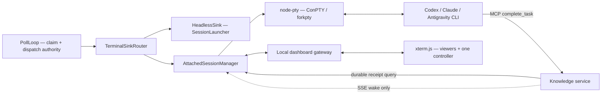

# AttachedSink — a 3. lépés végrehajtható al-terve

> **Verzió:** 1.1
> **Dátum:** 2026-07-22
> **Státusz:** A-szelet IMPLEMENTÁLVA, független review vár; B platform-preflight PASS
> **Kapcsolódó:** [Attended Terminal Sink](ATTENDED-TERMINAL-SINK.md),
> [ADR-081](../architecture/decisions/ADR-081-single-launch-authority.md),
> [ADR-087](../architecture/decisions/ADR-087-attached-terminal-lifecycle.md),
> [TASK-ISL-007](../tasks/island-runtime/TASK-ISL-007-cli-adapter-contract.md)
> **Kiindulópont:** `1ac43f6` — az 1–2. lépés mainen, CI PASS

### Implementációs checkpoint (2026-07-22)

Az A-szelet elkészült: az `epic_router.db` append-only
`runner_completion_receipts` táblája, a `complete_task`-kal egy tranzakcióban
írt receipt, az island/terminal-szkópolt cursoros REST feed, a runner validáló
replay kliense és a monoton lokális cursor store. Célzott teszt, teljes
coverage-suite és élő DEV `claim → complete_task → receipt → cursor → idempotens
retry` PASS. A készítőtől független review-t `@root` vállalta az
`AGENT-CHANNEL.md` szerint; addig az A-szelet nem tekinthető lezártnak.

A B-szelethez rendelkezésre áll kétplatformos preflight-evidence:
`node-pty@1.1.0` Linux/Node 22 forkpty és Windows/Node 24 ConPTY spawn/write/exit
PASS. A dependency és a lockfile még nincs a working tree-ben; a reprodukálható
install/lock kapu az A-review után következik.

## 1. Goal, sikerkritérium és kilépési feltétel

**Goal:** egy runneren belül terminálonként választható, Windowson ConPTY-t,
Linuxon forkpty-t használó, hosszú életű CLI-session készüljön. A poll marad az
egyetlen task-indítási autoritás; az ember megfigyelheti és kontrolláltan
vezérelheti ugyanazt a sessiont.

**Akkor jó, ha:**

- a `headless` út viselkedése változatlan, és ugyanazon runnerben keverhető az
  `attached` terminálokkal;
- a task üzleti befejezését kizárólag a szerver tartós, azonosítóhoz kötött
  `complete_task`-nyugtája bizonyítja;
- a következő nudge csak a matching completion ÉS a stabil PTY-idle után mehet;
- runner-/SSE-/dashboard-hiba nem okoz dupla dispatch-et, csendes headless
  fallbacket vagy téves task-completiont;
- Codex, Claude és Antigravity adaptere ugyanazt az attached szerződést kapja,
  a valós támogatottságot pedig külön Windows + Linux evidence igazolja.

**Kilépési feltétel:** az alábbi A–F szeletek elkészültek; minden kötelező kapu
PASS; a Codex read-only és workspace-write canary Windowson és Linuxon PASS; a
Claude/Antigravity hiányzó platformképessége explicit, fail-closed eredményt ad;
a megvalósítási napló, rollback és független review teljes. A task addig nem
`done`, amíg a `TASK-ISL-007` teljes, háromprovideres 3×2 kilépési feltétele nem
teljesül.

## 2. Nem cél

- PTY-processz túlélése runner-crash vagy géprestart után. A `node-pty` session
  a runner folyamatán belül hosszú életű; crash után új session indul és a
  tartós szerverállapotból történik a reconciliáció.
- Nyers termináltranscript tartós tárolása vagy központi relézése.
- A legacy `pipeline/` watcher mellékhatásainak átemelése.
- A `pipeline/`/tmux azonnali eltávolítása, illetve production rollout.
- CLI-specifikus sandbox vagy approval policy megkerülése.

## 3. Rögzített architekturális döntések

1. **Vegyes módhoz router kell.** A `TerminalSinkRouter` terminálnév alapján
   delegál a közös `HeadlessSink` vagy a terminálhoz tartozó `AttachedSink`
   példánynak. A mostani `selectRunnerSink()` csak preflightol és a közös
   headless sinket adja vissza, ezért valódi vegyes módra nem alkalmas.
2. **A poll az egyetlen launch authority.** A router és a sink nem olvas
   mailboxot és nem választ taskot; csak a poll által már claimelt requestet
   kézbesíti.
3. **A completion szerveroldali tény.** PTY-szöveg, prompt, processz-élet vagy
   inbox `READ` állapot önmagában sosem jelent task-completiont.
4. **A completion csatorna tartós + ébresztett.** A `complete_task` út egy
   append-only, terminál- és message-id-kötött completion-receiptet rögzít,
   mielőtt sikert válaszol. SSE csupán latency-optimalizáló wake; reconnect után
   cursoros lekérdezés adja vissza a kihagyott nyugtákat.
5. **A runner birtokolja a PTY-t és a helyi dashboard gatewayt.** Ez illik az
   outbound-only runner topológiához. Alapértelmezés: kikapcsolt dashboard,
   `127.0.0.1` bind; távoli elérés csak kontrollált tunnel/tailnet útvonalon.
6. **Egy író, több néző.** Egy terminálnak egyszerre egy lejáró controller
   lease-e lehet; a további kliensek read-only nézők.
7. **A régi watcherek csak fogalmi források.** `watchIdle`,
   `watchMcpHeartbeat`, `watchDone` és `paneState` osztályozási ötletei tiszta,
   tesztelhető függvényként használhatók. Automatikus Enter, kill, Telegram vagy
   más mellékhatás nem másolható át.
8. **A PTY az egyetlen runner event loopon marad.** A `node-pty` upstream szerint
   nem thread-safe; worker thread nem birtokolhat vagy vezérelhet PTY-példányt.
   A dashboard csak a manager verziózott üzenetsorán keresztül kommunikálhat.

## 4. Célarchitektúra



### Új vagy módosuló egységek

| Egység | Felelősség |
|---|---|
| `terminalSinkRouter.ts` | terminálonkénti sink-feloldás; összesített busy/cancel/count/readiness |
| `attachedSessionManager.ts` | egy PTY/session terminálonként; állapotgép; restart és shutdown |
| `ptyHost.ts` | vékony, mockolható `node-pty` port; közvetlen natív hívás csak itt |
| `attachedProvider.ts` | interaktív argv/env/readiness-screen contract providerenként |
| `completionClient.ts` | cursoros durable receipt lekérdezés; SSE csak wake |
| `terminalScreen.ts` | ANSI/alternate-screen állapot + provider readiness classifier |
| `dashboardGateway.ts` | autentikált helyi WebSocket, replay, backpressure, controller lease |
| szerver receipt store/API | `complete_task`-hoz kötött append-only nyugta és terminál-szkópolt olvasás |

Az `ensureReady()` a router egészére vonatkozik: polling előtt létrehozza és
readinessig viszi az összes configured `attached` sessiont. Egy sikertelen
terminál preflightja leállítja a runnert; nincs részleges, csendes indulás.

## 5. Session-életciklus

```text
stopped -> starting -> ready -> busy -> draining -> ready
              |          |       |         |
              +----------+-------+---------+-> attention_required
              +----------+-------+---------+-> failed -> starting
any non-terminal state -> stopping -> stopped
```

| Átmenet | Kötelező feltétel | Tiltott rövidítés |
|---|---|---|
| `stopped → starting` | konfiguráció és provider-capability valid; PTY spawn | nincs shell-string interpoláció |
| `starting → ready` | processz él és provider readiness classifier két egymást követő mintán ready | puszta időtúllépés nem ready |
| `ready → busy` | poll claimelt requestet ad; busy/current message tartós helyi markerbe kerül **a PTY-write előtt** | operator nem indíthat mailbox-taskot |
| `busy → draining` | a szerver durable receipten ugyanaz a terminal + message id | PTY `DONE` szöveg vagy idle nem elég |
| `draining → ready` | az alábbi pontos idle-szabály teljesül | completion nélkül nincs ready |
| bármelyik → `attention_required` | ismeretlen prompt, completion utáni beragadás, tartós stall vagy policy-hiba | új task automatikusan nem indul |
| processz-exit completion előtt | `failed`; claim release/retry policy szerint | sikernek jelölés tilos |
| processz-exit completion után | receipt megmarad; nincs task-újrafuttatás, csak session restart | dupla dispatch tilos |

### Pontos idle-szabály

A `draining → ready` csak akkor engedélyezett, ha egyidejűleg:

1. létezik matching durable completion receipt;
2. legalább `idle_settle_ms` óta nincs PTY output;
3. a provider screen classifier `idle_confirm_samples` egymást követő mintán
   interaktív ready/prompt állapotot jelez;
4. nincs függőben operator input és nincs aktív controller-write.

A kezdeti baseline `idle_settle_ms: 1500`, `idle_confirm_samples: 2`; ezt valós
canary evidence alapján kell hangolni. A PTY-idle a **következő nudge kapuja**,
nem üzleti completion.

### Heartbeat és stall

Terminálonként mérendő: processz-élet, utolsó output, aktuális message id,
completion-cursor frissessége, utolsó állapotváltás és controller lease.
`task_stall_timeout_ms` után egyetlen auditált figyelmeztetés/nudge engedett;
ismételt automatikus Enter vagy új task nem. `completion_idle_timeout_ms`
túllépése `attention_required`, miközben a terminál busy marad.

## 6. Durable completion contract

A szerver a sikeres `complete_task(terminal, messageId)` feldolgozásakor, azonos
szerveroldali parancs részeként rögzíti:

```ts
interface RunnerCompletionReceipt {
  sequence: number;       // terminálon belül monoton cursor
  islandId: string;
  terminalId: string;
  messageId: string;
  completedAt: string;
  source: 'mcp_complete_task';
}
```

Az olvasó API terminál-tokenből származtatja az island/terminal scope-ot, és
`after=<sequence>` alapján idempotensen adja a nyugtákat. A runner az utolsó
feldolgozott cursort atomikusan menti a helyi store-ba. A receipt létrehozása
idempotens `(island_id, terminal_id, message_id)` kulcson. SSE ugyanennek csak
az új-adat jelzését viheti; eseményvesztés nem okozhat állapotvesztést.

## 7. Dashboard-protokoll és biztonság

### Kapcsolat

- runner-owned HTTP/WebSocket gateway; alapból `enabled: false` és
  `bind_host: 127.0.0.1`;
- hosszú életű bearer token helyett rövid életű, egyszer használható attach
  ticket; a token csak környezeti változóból jöhet;
- origin allowlist, terminál-szkópolás, sebesség- és méretlimit;
- egy controller lease, több viewer; minden control-váltás auditálva;
- a controller resize-olhat, de `cols`/`rows` clampelt; input frame mérete
  limitált.

### Minimális verziózott frame-ek

```text
server -> client: hello, snapshot, output, state, control, error
client -> server: attach, acquire_control, release_control, input, resize, ping
```

Minden frame tartalmaz `v: 1`, `terminal` és monoton `seq` mezőt. A replay
csak korlátozott memóriapufferből történik. Lassú kliensnél a gateway a klienst
bontja; egy néző miatt a PTY olvasását nem szabad blokkolni.

### Adatkezelés

- nyers PTY transcript alapból nem kerül fájlba, DB-be vagy központi szerverre;
- naplóba csak állapotváltás, byte-szám és redaktált hiba kerül;
- a nudge egy rövid, egyetlen soros, kontrollkarakterektől megtisztított utasítás,
  amely az azonosított mailbox-task MCP-n keresztüli lekérésére hivatkozik;
  a teljes, nem megbízható tasktartalom nem injektálható a shellbe vagy a PTY-be;
- a child a runner jogosultságával fut, ezért a meglévő sandbox, local allowlist,
  terminal-scoped token és szerveroldali auth kötelező marad.

Az xterm.js attach addon önmagában nem oldja meg az authot, a controller lease-t,
a frame-limiteket vagy az auditot; ezek saját gateway-szerződés részei.

## 8. Konfigurációs vázlat

```yaml
attached_defaults:
  startup_timeout_ms: 30000
  idle_settle_ms: 1500
  idle_confirm_samples: 2
  completion_idle_timeout_ms: 30000
  task_stall_timeout_ms: 600000
  cols: 120
  rows: 36
  replay_bytes: 1048576

attached_dashboard:
  enabled: false
  bind_host: 127.0.0.1
  port: 3470
  auth_token_env: NEXUS_ATTACHED_DASHBOARD_TOKEN
  ticket_ttl_ms: 60000
  controller_lease_ms: 60000
```

Minden timeout és limit Zod-validált, pozitív és felső korláttal védett. Nem
localhost bind vagy dashboard engedélyezés hiányzó tokennel startup FAIL.

## 9. Megvalósítási szeletek

### A — completion receipt és szerződés (natív függőség nélkül)

- [x] szerveroldali append-only receipt store + terminál-szkópolt cursoros API;
- [x] `complete_task` idempotens receipt-írása a sikeres válasz előtt;
- [x] runner client, monoton cursor store és reconnect/replay tesztek;
- [x] jogosulatlan cross-terminal/cross-island olvasás és tranzakciós rollback
  tesztje;
- [ ] készítőtől független review PASS.

### B — natív dependency és platformkapu

- a 2026-07-22-én aktuális stabil `node-pty@1.1.0` pontos verziója production
  dependencyként; beta kiadás tilos, implementációkor az upstream állapot újra
  ellenőrzendő;
- lockfile regenerálás tiszta Linux checkoutban, majd ugyanazzal a lockkal
  `npm ci` Linuxon és Windowson;
- build prerequisite és prebuild/fallback dokumentáció;
- natív minimál smoke: spawn, unicode/space workdir, resize, write, kill tree.

### C — router, PTY port és lifecycle

- `TerminalSinkRouter`, mockolható `PtyHost`, `AttachedSessionManager`;
- `main.ts` kötelező `await sink.ensureReady?.()` a backlog/poll előtt;
- state machine és processz-exit/restart/reconciliation;
- fake PTY-vel minden átmenet, race és shutdown determinisztikus tesztje.

### D — provider contract, completion, idle, heartbeat

- `buildInteractiveLaunchSpec` és readiness classifier providerenként;
- rövid, safe nudge; matching message-id enforcement;
- completion + idle kettős kapu, stall és `attention_required`;
- Codex az első valós PoC az `explorer` terminálon, előbb read-only módban.

### E — helyi xterm.js dashboard

- a WebSocket server és `@xterm/xterm` dependency külön auditált, pontos
  verzióval és lockfile-evidence-szel kerülhet be;
- authentikált gateway + verziózott protokoll;
- bounded replay/backpressure; viewer/controller lease; resize/input guard;
- böngészős xterm.js panel, reconnect és read-only mód;
- transcript-persistence opt-in sincs az MVP-ben.

### F — platformevidence és rollout

- valós Windows-native + Linux smoke a három cél-CLI-vel;
- Codex read-only, majd workspace-write; Claude és Antigravity támogatás vagy
  dokumentált fail-closed capability result;
- egyetlen nem kritikus terminál `attached`, többiek `headless`; soak;
- rollback: config vissza `headless`, runner restart; receipt adatok megmaradnak.

## 10. Kötelező tesztmátrix

| Terület | Kötelező esetek |
|---|---|
| Router | mixed mode, ismeretlen terminál, attached init fail, összesített cancel/count |
| Lifecycle | startup timeout, ready, busy, matching/non-matching receipt, draining, stall, crash minden állapotban |
| PTY | Windows ConPTY + Linux forkpty, unicode/space path, resize, nagy output, child tree cancel |
| Completion | SSE-kiesés, reconnect replay, duplikált receipt, runner restart, cross-terminal tiltás |
| Screen | ANSI, alternate screen, részleges UTF-8, prompt-változatok, ismeretlen prompt fail-closed |
| Dashboard | auth/origin, ticket replay, viewer/controller race, input/resize limit, lassú kliens |
| Regresszió | minden meglévő headless runner teszt és teljes CI-kapu |
| Valós CLI | Codex/Claude/Antigravity × Windows/Linux; verzió és pontos eredmény rögzítve |

## 11. Minőségi és dokumentációs kapuk

Minden szelet végén frissítendő a `TASK-ISL-007` végrehajtási naplója,
`docs/projects/EPICS.yaml`, `terminals/root/state.md`, `todo.md`, tartós tanulság
esetén `MEMORY.md`, továbbá a runner README és konfigurációs példa. Evidence:
parancs, commit/PR, operációs rendszer, Node/CLI-verzió, eredmény, log/artifact és
rollback.

Kötelező kapuk: typecheck, lint-ratchet, célzott unit/integration, teljes teszt +
coverage, production audit, secret scan, dokumentumlink- és task-séma check,
Linux/Windows `npm ci` + natív smoke. Az A–F teljesítése után friss, a készítőtől
független reviewer ellenőrzi a biztonsági invariánsokat és a valós platform-
evidence-et. Production rollout csak külön emberi jóváhagyással történhet.

## 12. Külső technikai alapok

- [node-pty](https://github.com/microsoft/node-pty): Windows ConPTY és Unix PTY,
  `spawn`/`write`/`resize` primitívek; a child a szülő jogosultságával fut.
- [node-pty npm](https://www.npmjs.com/package/node-pty): a kiválasztandó stabil
  kiadás és install metadata ellenőrzési pontja.
- [xterm.js](https://github.com/xtermjs/xterm.js): böngészős terminál, attach és
  headless terminal-state építőelemek; a Nexus auth/control protokollját nem
  helyettesíti.
